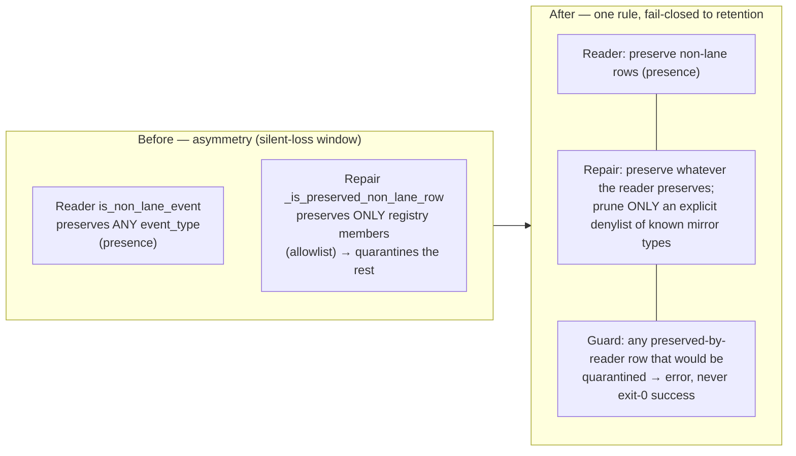

# Mission Specification: Silent-Write Hardening Residuals

**Mission Branch**: `fix/silent-write-hardening-residuals`
**Created**: 2026-09-23
**Status**: Draft
**Input**: Residual findings from PR #4938's landing-pass second-opinion squad (tracked in issue #4993, epic #2720), verified still-live on current `main` (HEAD `138d25dd0f`).

## Context

PR #4938 fixed three acute exit-0 silent-data-loss defects (#4908 charter recompile, #4897 mission-state repair, #4894 traces merge driver). A landing-pass squad (correctness, design/authority, and SSOT/whack-a-field lenses, converging independently) confirmed three **residual** weaknesses that do not lose data on today's registered inputs but keep a latent silent-loss window open as the system grows. This mission closes that window at the root and folds in two adjacent hardening items surfaced by the same squad.

The residuals were verified still-live against current `main`:

- **A — mission-state repair preserve-set asymmetry.** The durable status-event reader `status/store.py::is_non_lane_event` is *presence-permissive* (fallback `return "event_type" in obj`, `store.py:645`): it preserves any row bearing an `event_type`. The `doctor mission-state --fix` repair `migration/mission_state.py::_is_preserved_non_lane_row` (~1943-2018) is *registry-restrictive*: it preserves only `AUTHORITATIVE_NON_LANE_EVENT_TYPES` (+ retrospective + annotation) and quarantines everything else. So an authoritative non-lane `event_type` written by a **new subsystem before it is added to the registry** looks healthy at runtime (reader preserves it) but is silently quarantined and dropped by `--fix` — the #4897 shape in a new coat. The `_registry_authoritative_quarantine_violations` fail-closed guard is powered by the *same* registry, so it structurally cannot catch an unregistered type.
- **B — two divergent `catalog.mission` readers.** `cli/commands/charter/generate.py::_read_catalog_mission_from_charter_yaml` reads `charter.yaml`'s `catalog.mission` via ruamel round-trip `YAML()` (preserve_quotes); `charter_runtime/preflight/references_refresh.py::_read_catalog_mission_and_template_set` reads the same field via `YAML(typ="safe")`. Two parsers over one field is a concrete drift risk on edge-case documents. (Issue #4993 says "three readers"; the claimed third reads `catalog.languages`, a different field — the true count is **two**.)
- **C — traces merge-driver hardening (benign today: over-inclusion, never loss).** `cli/commands/merge_driver.py` detects fences with a backtick-only regex (`_TRACE_FENCE_MARKER = re.compile(r"^```")`, `:308`), so a heading-like line inside a `~~~` tilde-fenced block is misread as a section boundary; and `_trace_block_key` keys blocks by their raw first heading line (`block[0]`, `:365`) deduped via `setdefault` (`:400`/`:403`), so two sections sharing a duplicate heading collide in the base-aware stale-drop path.

The durable fix for A changes what `doctor mission-state --fix` prunes (real blast radius on a data-repair tool). Per operator decision `DM-01M37QQ62T11G9JPZQJE2GYSYH`, this mission **ships the full inversion**, gated by an ADR that records the changed quarantine semantics.

### Contract collapse (Finding A)



## User Scenarios & Testing *(mandatory)*

### User Story 1 - Repair never silently drops a not-yet-registered authoritative record (Priority: P1)

An operator runs `spec-kitty doctor mission-state --fix` on a mission whose event log contains an authoritative non-lane record whose `event_type` a future subsystem introduced but has not yet been added to the registry. The runtime already treats the record as real; the repair must too.

**Why this priority**: This is the open silent-data-loss window — the acute #4897 class recurring for any unregistered future type. Closing it structurally (not by another allowlist entry) is the mission's core value.

**Independent Test**: Craft a mission event log with an authoritative-shaped non-lane row whose `event_type` is deliberately absent from `AUTHORITATIVE_NON_LANE_EVENT_TYPES`; run repair; assert the row survives in active state and repair does not report exit-0 success while dropping it. Red-first: the same test fails against the pre-inversion repair.

**Acceptance Scenarios**:

1. **Given** a mission log with an unregistered authoritative non-lane row that the reader preserves, **When** `doctor mission-state --fix` runs, **Then** the row remains in active state (not quarantined) and is not dropped.
2. **Given** a row whose `event_type` is on the explicit prunable-mirror denylist, **When** `--fix` runs, **Then** the row is pruned exactly as before.
3. **Given** a repair that would nonetheless quarantine a row the reader preserves, **When** `--fix` runs, **Then** it surfaces a non-zero / error outcome rather than reporting `errors=0` success.
4. **Given** a healthy mission with two authoritative rows sharing one `event_id` (an ordinary merge/replay artifact, one survivor kept in canonical), **When** `--fix` runs, **Then** it dedupes without the guard hard-erroring (the #4938-folded regression stays fixed).

---

### User Story 2 - The configured mission type reads identically everywhere (Priority: P2)

Two internal code paths read the project's `charter.yaml` `catalog.mission` field. On an edge-case document they must never disagree.

**Why this priority**: A latent SSOT/whack-a-field risk — divergent parsers over one field produce inconsistent behavior that is hard to diagnose. Consolidating removes the divergence class; lower urgency than the active silent-loss window.

**Independent Test**: Grep proves exactly one accessor for `catalog.mission`; both former call sites delegate to it; a shared unit test exercises the accessor over normal and edge-case (quoted / commented) charter documents.

**Acceptance Scenarios**:

1. **Given** any valid `charter.yaml`, **When** either former call site reads `catalog.mission`, **Then** both resolve the identical value through one shared accessor.
2. **Given** a `charter.yaml` with no `catalog.mission`, **When** the accessor reads it, **Then** it returns the same well-defined absent result to every caller.

---

### User Story 3 - Traces merges survive unusual markdown (Priority: P3)

An operator (or the merge driver during a lane consolidation) merges a `traces/` file that uses tilde `~~~` fences or repeats a heading across sections. The 3-way base-aware stale-drop must not misread a fenced heading-like line or collide two same-titled sections.

**Why this priority**: Benign today (the failure mode is over-inclusion, never data loss) but a correctness edge worth closing while the context is loaded. Lowest urgency of the three.

**Independent Test**: Merge a synthetic traces file containing (a) a heading-like line inside a `~~~` block and (b) two sections with an identical heading; assert no section is dropped or mis-attributed and no fenced content is treated as a boundary.

**Acceptance Scenarios**:

1. **Given** a traces block fenced with `~~~` that contains a heading-like line, **When** the driver splits sections, **Then** the fenced line is not treated as a section boundary.
2. **Given** two distinct sections that share an identical heading line, **When** the base-aware stale-drop runs, **Then** each section is keyed distinctly and neither is dropped by collision.

---

### Edge Cases

- A benign duplicate-`event_id` authoritative drop whose survivor stays in `canonical_rows` must **not** trip the fail-closed guard (regression folded in #4938 — preserve it).
- A genuine prunable-mirror `event_type` (on the denylist) must still be pruned — the inversion changes the default, not the intent to prune known mirrors.
- `charter.yaml` present but `catalog.mission` absent, empty, or quoted; a commented-out mission line.
- A `~~~` fence and a ```` ``` ```` fence appearing in the same traces block; an unterminated fence.

## Requirements *(mandatory)*

### Functional Requirements

| ID | Title | User Story | Priority | Status |
|----|-------|------------|----------|--------|
| FR-001 | Preserve-by-default repair | As an operator, I want `doctor mission-state --fix` to preserve any row the durable reader treats as non-lane (presence-based), pruning only an explicit denylist of known-prunable mirror `event_type`s, so an unregistered future authoritative record is never silently dropped. | High | Open |
| FR-002 | Guard covers unregistered authoritative rows | As an operator, I want the fail-closed quarantine guard to fire for any reader-preserved row that would be quarantined (not only registry members), so a would-be silent drop surfaces as a non-zero/error outcome instead of exit-0 success. | High | Open |
| FR-003 | ADR records inverted quarantine semantics | As a maintainer, I want an Accepted ADR documenting the preserve-by-default + denylist inversion and its `--fix` blast radius, so the changed pruning behavior is a recorded decision, not an undocumented drift. | High | Open |
| FR-004 | Single `catalog.mission` accessor | As a maintainer, I want one shared accessor for `charter.yaml` `catalog.mission` that both former readers delegate to, using one YAML parsing behavior, so the two paths cannot diverge. | Medium | Open |
| FR-005 | Tilde-fence recognition in traces driver | As an operator, I want the traces merge driver to treat `~~~` fences equivalently to backtick fences when detecting section boundaries, so a heading-like line inside a tilde-fenced block is not misread as a boundary. | Low | Open |
| FR-006 | Distinct block keys for duplicate headings | As an operator, I want the traces driver's base-aware stale-drop to key blocks so two sections sharing a heading do not collide, so no section is dropped or mis-attributed by key collision. | Low | Open |
| FR-007 | Close and correct #4993 | As a maintainer, I want #4993 closed by this mission and its inaccurate "three `catalog.mission` readers" corrected to two, so the tracker reflects the resolved, verified state. | Medium | Open |

### Non-Functional Requirements

| ID | Title | Requirement | Category | Priority | Status |
|----|-------|-------------|----------|----------|--------|
| NFR-001 | No silent event loss | Across the mission-state repair regression corpus, `doctor mission-state --fix` reduces the authoritative event set for a reader-preserved row in exactly 0 cases (every such reduction is either an explicit denylist prune or a surfaced error). | Reliability | High | Open |
| NFR-002 | No preservation regression | All currently-preserved non-lane classes (annotation, retrospective, lifecycle, DecisionPoint, WPStatusChanged, review_result) remain preserved by the repair: 0 regressions in the existing preservation test suite. | Reliability | High | Open |
| NFR-003 | Single-source config read | Exactly 1 accessor reads `catalog.mission`; a repository grep for direct `catalog`→`mission` reads returns 0 outside that accessor. | Maintainability | Medium | Open |
| NFR-004 | Byte-faithful traces merge | For the traces-driver hardening corpus, merged output loses 0 sections and preserves within-section content byte-for-byte (over-inclusion permitted, loss not). | Reliability | Medium | Open |

### Constraints

| ID | Title | Constraint | Category | Priority | Status |
|----|-------|------------|----------|----------|--------|
| C-001 | No asset_preservation routing | Do not route any of these three seams through the `asset_preservation` guard: it is filesystem-path granularity (`OwnershipProof` over a `Path`), while these are content/row/line-level writes — a category error. | Technical | High | Open |
| C-002 | No traces contract refactor | Do not broadly refactor the traces merge-driver fence/section contract; its byte-preserving round-trip semantics are legitimately distinct from render-oriented parsers. Harden only the two named edges (tilde fence, duplicate-heading key). | Technical | High | Open |
| C-003 | Fail-closed toward retention, behind an ADR | The inverted repair must fail-closed toward retention — dropping a reader-preserved row requires an explicit denylist entry; the behavioral change ships gated by the FR-003 ADR. | Technical | High | Open |
| C-004 | No dependency changes | The mission introduces no new runtime or dev dependencies. | Technical | Medium | Open |
| C-005 | Terminology canon | Use canonical **Mission** terminology; no `feature*` aliases in new identifiers, fields, or prose. | Business | Medium | Open |

### Key Entities

- **Authoritative non-lane event**: a `status.events.jsonl` row that is not a lane-state transition but must be preserved (lifecycle, DecisionPoint, retrospective, annotation, WPStatusChanged, review_result, and any future authoritative type). The authoritative store is `status.events.jsonl`; `decisions/index.json` is a derived fold.
- **Prunable-mirror denylist**: the explicit, named set of `event_type`s the repair may drop as known derived mirrors — the *only* rows `--fix` prunes after the inversion.
- **`catalog.mission` accessor**: the single shared reader of the configured mission type from `charter.yaml`.
- **Trace block / section**: a `<!-- section:... -->`-delimited unit in a `traces/` file; fenced code inside it must not be parsed as structure.

## Success Criteria *(mandatory)*

### Measurable Outcomes

- **SC-001**: An unregistered authoritative non-lane record survives `doctor mission-state --fix` (0 silent drops), proven by a red-first regression test that fails against the pre-inversion repair and passes after.
- **SC-002**: `catalog.mission` is read through exactly 1 accessor; a repository grep confirms 0 other direct readers of that field.
- **SC-003**: A traces file containing a `~~~`-fenced heading-like line and two duplicate-heading sections round-trips through the merge driver with 0 lost or mis-attributed sections.
- **SC-004**: Issue #4993 is closed by this mission's PR, with its reader count corrected from three to two.
- **SC-005**: 0 regressions in the existing non-lane preservation and duplicate-`event_id` dedup suites.
