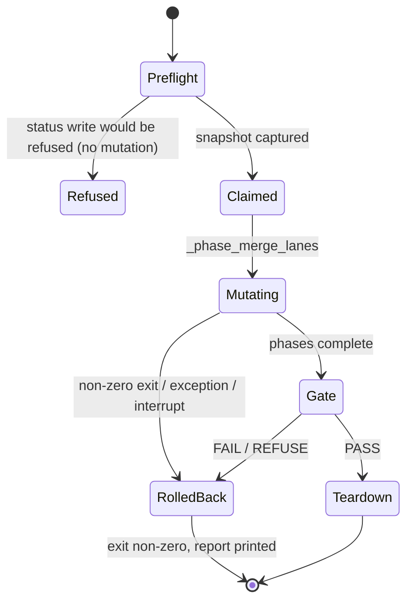

# Data Model: single-rollback-authority-01M3RCP4

No new persisted fields. The consolidation record (`ConsolidationState`) keeps its schema.

| Entity | Owner | Role in this mission |
|--------|-------|----------------------|
| `pre_mutation_refs` | `rollback.capture_pre_mutation_snapshot` | the only restore target; captured once before `_phase_merge_lanes` |
| `post_mutation_refs` | `_records_post_mutation_tips` decorator | CAS expected value per movable branch; recorded by every ref-moving phase on return and on raise |
| `restore_targets` | `rollback.begin_attempt` | per-attempt restore commit |
| `pending_coord_reconcile` | `_persist_coord_reconcile_marker` | strand marker; cleared by the authority after a full coordination restore |
| `mission_number_baked`, `completed_wps`, `reconciliation_passed_target_sha` | authority `_clear_bookkeeping` | reset only after a full restore |
| `_MergeRunState.pre_bake_target_baseline_sha` | executor | **removed** (only the retired orphan-bake revert read it) |
| Protected-target verdict (`Refused`) | `WorkflowMutationPolicy.assert_allowed` via the extracted transaction gate | preflight refusal payload: `error_code`, `message`, `next_step` |

## State transitions of one consolidate attempt

