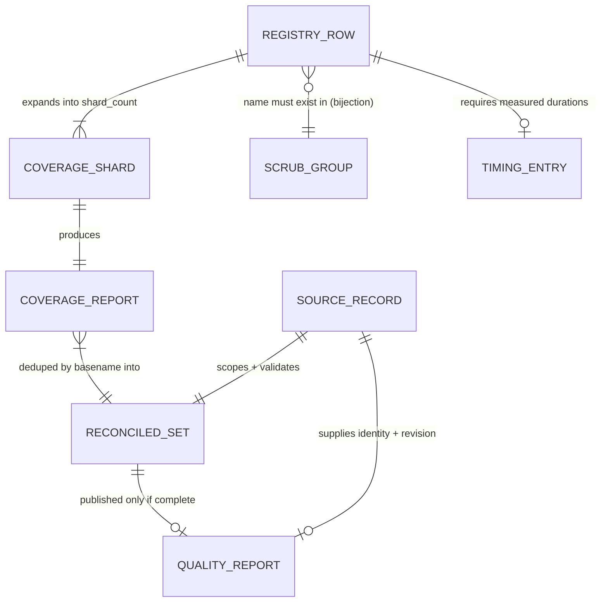

# Phase 1 Data Model — Per-PR Sonar reuses CI Modules coverage

**Mission**: `sonar-per-pr-coverage-reuse-01M2FR32` · **Date**: 2026-09-14

This mission has no application runtime entities. Its "data model" is the set of **committed
declarative records** and **run-scoped artefacts** that together decide what CI runs, what it
measures, and what the report is allowed to say. Getting these shapes wrong is how the mission fails
silently, so they are modelled explicitly.

---

## 1. Registry row — `.github/ci-module-registry.yml` `modules[]`

The single declared authority for what CI runs (C-002).

| Field | Meaning | Changed by this mission |
|---|---|---|
| `module` | Row name. **Must** appear as a group in the retirement scrub. | **+2 rows** (WP01) |
| `roots` | `src/**` globs, traceability only | new rows only |
| `cov_targets` | Dotted packages fed to one `--cov=` flag each. **Determines measurement breadth.** | **All rows broadened** (WP01, FR-013) |
| `tier` | Classification label. *Not* a marker selection — every row is `standard`. | no |
| `shard_count` | Matrix leaves; sized by greedy-LPT over measured durations | new rows only |
| `test_dirs` | Explicit dirs for AGGREGATE rows with no `tests/<module>` mirror. **Preferred over the mirror, not unioned with it.** | new rows only |

**Invariants** (each enforced, each a way to fail):
- `module` names are **bijective** with `ci_retirement_scrub.json` groups
  (`test_module_shard_registry.py:157-160`). A new row without a scrub group reds.
- Every row has measured durations in `ci-shard-timings.json` (`:93`). Absent → reds.
- `test_dirs`, when declared, must exist and collect >0 tests
  (`:237-251`; `module-tests.yml:166-168` exits 64 on zero).
- Inter-shard skew ≤20% — but computed from the **committed** timings file, so it passes vacuously
  on unchanged data. **This guard cannot catch a stale-timings regression; WP01 must re-measure.**

**Breadth rule (new, FR-013)**: `cov_targets` must include every top-level package a row's tests can
reach, not only the package the row is named for. Union semantics make over-inclusion safe and
under-inclusion lossy.

## 2. Scrub group — `tests/release/ci_retirement_scrub.json` `groups[].group`

The recognised module-name vocabulary. Bijective with registry rows (above). Two entries added
(WP01). Verified: registry and scrub each currently hold exactly the same 17 names.

## 3. Timing entry — `.github/ci-shard-timings.json` `module_test_durations[<module>]`

An ordered list of per-test call-phase durations, paired **positionally** with collected node ids.

**The trap**: `module-tests.yml:205-212` — when `len(durations) != len(node_ids)` it silently falls
back to `[1.0] * n`, collapsing greedy-LPT to a test-count split for that **whole module**. The
registry header forbids exactly this (*"never guessed, never from file counts"*). Adding tests to a
row without refreshing its durations triggers the fallback **and no gate notices**.

**Known undercount**: call-phase durations exclude per-test fixture setup; two rows already carry
comments saying so. Local timings do not transfer to CI.

## 4. Coverage report — `coverage-<tier>-<module>-shard<i>-of-<n>.xml`

Per-shard `coverage.py` XML, `relative_files = true`, paths relative to the **tested merge tree**.

- **Merge semantics: union.** A line covered in any report is covered. This is what makes broadening
  safe and is the mission's central mechanism.
- **Breadth is baked in at production time.** A line outside the producing shard's `--cov` targets is
  absent, not zero — unrecoverable downstream. This is the FR-013 defect.
- Basenames are the dedup key; a collision within one run fails loudly (`ci-aggregate.yml:250-258`).

## 5. Source record — `ci-aggregate-source/source.json`

Written by `scripts/ci/aggregate_source.py:80-94`.

| Field | Use here |
|---|---|
| `repository` | base repo; validated. **Not** an origin signal. |
| `run_id`, `run_attempt` | provenance |
| `head_sha` | PR head |
| `base_sha` | merge base |
| `tested_sha` | **the revision measured** → NFR-008 binds analysis to it |
| `pr_number` | **validated** identity → FR-005 |

**Absent and needed**: `head_repository` (origin, FR-011), head branch **name**, base branch **name**.
Sourced by one authenticated read keyed on the validated `pr_number` — never from
`workflow_run.pull_requests[]`, which `aggregate_source.py:45-47` documents as a mutable projection
and deliberately refuses.

`pr_number` is validated against the immutable `referenced_workflows` merge ref (`:50-60`), with the
merge parents bound to the run head (`:64-67`). This is a *trustworthy* identity, which is why the
spec insists on it rather than the convenient one.

## 6. Reconciled set — `ci-aggregate-reconciled-coverage`

The per-change assembly, plus a completeness verdict.

- `complete` / `missing` step outputs; expected basenames derived from the registry read out of the
  **tested** tree, not the trusted checkout (`ci-aggregate.yml:213-245`).
- **Uploaded even on failure** (`:301` `if: always()`, `:306` `warn`), and `complete=false` is written
  **before** `sys.exit(1)` (`:287-297`). So artefact presence is *not* evidence of completeness — the
  consumer must read the verdict. FR-007 depends on this distinction.
- **Stale fallback** (`:150-175`) can substitute another change's reports; gated off for PR-triggered
  runs at `:153`. NFR-006 pins that condition rather than inheriting it.

## 7. Pinning rule (conceptual)

An automated check asserting the pipeline retains a property, carrying a justification that must stay
true (C-005).

| Attribute | Notes |
|---|---|
| Subject | the workflow/job/property pinned |
| Assertion form | exact-string, set-equality, derived-relation, or fault-injection. **Exact-string forms do not survive relocation** — the pinned literal is unsatisfiable under the new trigger. |
| Justification | prose that must remain true; the `NON_BLOCKING_ALLOWLIST` entry currently asserts a step this mission deletes |
| Disposition | *relocate* / *rewrite* / *retire-as-moot* — mandatory under FR-010 |

**Enforcement asymmetry, and the reason FR-010 demands derivation**: a rule that goes **red** is
found by CI. A rule that goes **greener by deletion** is found by nobody. The v1 inventory missed an
exact-job-set pin for precisely this reason.
