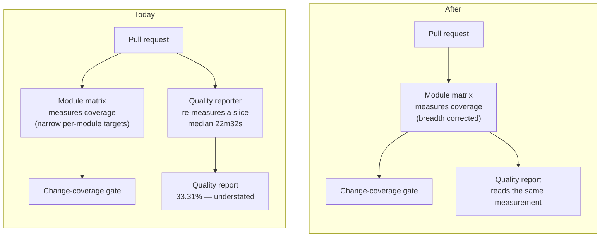

# Mission Specification: Per-PR Sonar reuses CI Modules coverage

**Mission Branch**: `issue-4334-sonar-reuse-shard-coverage`
**Created**: 2026-09-14
**Revised**: 2026-09-14 — post-spec adversarial squad fold (4 lenses; see `work/4334-sonar-coverage-reuse/squad-post-spec.md`)
**Status**: Draft
**Input**: GitHub issue [#4334](https://github.com/spec-kitty/spec-kitty/issues/4334) (P0, tech-debt, milestone 4.0.0). Research: `work/4334-sonar-coverage-reuse/findings.md`. Squad findings and adjudication: `work/4334-sonar-coverage-reuse/squad-post-spec.md`.

## Context

Every pull request measures the same tests twice. The per-change quality reporter re-runs a slice of
the suite under coverage — a **median of 22m32s** (n=12 same-repo runs, 2026-09-10→14; range
12m50s–23m15s) — while the per-module test matrix has already measured coverage for the identical
commit. The duplicate is then largely discarded, because the reporter's measurement is *narrower*
than the matrix's: it reports **33.31%** of the statement union against the matrix's **55.15%**.

This mission makes the per-change report read the measurement that already exists.

Reuse is **not** a pure gain, and the spec says so plainly. The matrix measures each module with a
**narrow per-module coverage target**, so a test in one module that exercises another module's code
has its measurement silently dropped. 4,391 statements are covered by the retiring slice and not by
the matrix; **58 of 72 `specify_cli` subpackages** are measured only through one broad-target row
whose tests do not exercise most of them. Closing that measurement gap is therefore **in scope**
(FR-013), not deferred — otherwise this mission would trade a large understatement for a smaller
permanent one and call it a win.

## User Scenarios & Testing *(mandatory)*

### User Story 1 - A pull request stops measuring the same tests twice (Priority: P1)

A contributor opens a pull request. The checks measure their change once. No check re-measures work
another check has already measured.

**Why this priority**: The reported defect, and the only story that reduces cost on every pull
request forever.

**Independent Test**: Inspect a pull request's completed check suite. No check outside the module
test matrix produces a coverage measurement. Sum the job durations; the reclaimed runner-minutes are
visible against a recorded baseline run.

**Acceptance Scenarios**:

1. **Given** a completed pull-request check suite, **When** an operator reviews every check that ran,
   **Then** exactly one of them produced a coverage measurement.
2. **Given** a pull request, **When** the quality report is produced, **Then** it was derived from the
   measurement the module test matrix recorded for that same change.
3. **Given** a pull request, **When** the reporting check runs, **Then** it contains no step that
   executes the project's tests.

---

### User Story 2 - The reported coverage figure is trustworthy in both directions (Priority: P1)

A reviewer reads a coverage figure and can trust it. Lines the tests genuinely exercise are reported
as covered — including lines exercised by a test that lives in a different module from the code it
runs. No file's reported coverage goes *down* as a result of this change.

**Why this priority**: An understated figure invites reviewers to demand tests for already-tested
lines. Fixing the headline number while silently regressing 2,808 statements would replace a visible
error with an invisible one, which is worse.

**Independent Test**: For every source file, compare the reported coverage before and after. No file
regresses. Spot-check a file whose only exercisers live in another module's test directory.

**Acceptance Scenarios**:

1. **Given** a source line exercised only by a test outside the retiring slice, **When** a change
   touches it, **Then** the report shows it covered.
2. **Given** a source file exercised by tests in a different module's directory, **When** the report
   is produced, **Then** its measured coverage is not lower than the retiring slice reported.
3. **Given** one change, **When** the per-change and scheduled reports both describe it, **Then**
   neither reports a file as less covered than the other by more than measurement noise.

---

### User Story 3 - The test inventory tells the truth about what runs per change (Priority: P2)

Two test directories run today only through the step being retired and through a scheduled
interpreter sweep. After this mission they are declared in the test inventory and run as part of the
normal per-change pass. A third group — tests excluded by marker from every selection — is reported
as a pre-existing gap rather than quietly inherited.

**Why this priority**: Without it, the retirement removes those directories' *per-change* execution.
It is P2 rather than P1 because they retain scheduled coverage, so nothing becomes wholly unrun.

**Independent Test**: Consult the declared inventory; both directories appear. Trigger a change and
confirm their tests execute in the matrix.

**Acceptance Scenarios**:

1. **Given** the declared test inventory, **When** an operator looks for each directory, **Then**
   both are present and claimed by a row that collects more than zero tests.
2. **Given** a pull request, **When** the matrix completes, **Then** tests in both directories have
   executed and their results are reported.
3. **Given** the marker-excluded tests identified during planning, **When** the mission closes,
   **Then** each is either covered or recorded in the tracker as a pre-existing gap with a handle.

---

### User Story 4 - Nobody mistakes a green pipeline for a working report (Priority: P2)

An operator reading the change learns precisely which external conditions block publication, which
are fixed here, and which are tracked elsewhere.

**Why this priority**: The pipeline can go fully green while the report publishes nothing. Honest
reporting over convenience is a standing project rule.

**Independent Test**: Read the change's description and the new job's in-tree comment. Both name the
external blocker, scope it out, and link a tracking issue.

**Acceptance Scenarios**:

1. **Given** the pull request, **When** an operator reads it, **Then** the external blocker is named,
   scoped out, and linked to a real tracking issue.
2. **Given** the new reporting job, **When** a future reader opens the workflow file, **Then** an
   in-tree comment explains why the report may not publish and points at the tracker.
3. **Given** this mission, **When** acceptance is judged, **Then** no criterion depends on an action
   available only through an external vendor's interface.

### Edge Cases

- **Incomplete measurement.** Refuse to publish rather than report a partial figure that reads as a
  coverage regression. The assembly step already fails closed; the report must not publish anyway.
- **Partial re-run.** When only failed slices are retried, the report assembles that change's own
  complete measurement and never blends in another change's.
- **A contribution from a fork.** Receives no report, and cannot cause a failed check. The mechanism
  that guarantees this **changes** with the trigger (see NFR-004) and must be explicit.
- **A push to the primary branch.** The per-change report must not run, so it cannot displace the
  scheduled report that owns the branch baseline.
- **Quality service unavailable or unconfigured.** Skip with an advisory notice; never fail a change.
- **Cross-module exercise.** A test that exercises code owned by another module must have that
  measurement retained, not dropped.
- **Documentation-only change.** Any check the retiring step ran unconditionally must either keep a
  home or be recorded as a deliberate reduction.

## Requirements *(mandatory)*

### Functional Requirements

| ID | Title | User Story | Priority | Status |
|----|-------|------------|----------|--------|
| FR-001 | Single measurement per change | As a contributor, I want my change measured once, so that I am not waiting on duplicated work. | High | Open |
| FR-002 | Report reads the existing measurement | As a reviewer, I want the report derived from the measurement the per-change test pass recorded, so that one measurement serves every consumer. | High | Open |
| FR-003 | Retire the duplicate measurement step | As a maintainer, I want the reporter's own test-executing step removed. | High | Open |
| FR-004 | Report waits for the measurement | As a reviewer, I want the report produced only after the change's test pass finished. | High | Open |
| FR-005 | Identity from the validated source record | As a reviewer, I want the report's change identity taken from the same validated record the measurement comes from, never from a mutable event projection. | High | Open |
| FR-006 | Orphaned directories declared in the inventory | As a maintainer, I want the two undeclared test directories added to the inventory, with every companion inventory artefact updated in the same change. | High | Open |
| FR-007 | Incomplete measurement is refused | As a reviewer, I want publication withheld when the measurement is incomplete. | High | Open |
| FR-008 | Absent service degrades gracefully | As a contributor, I want the report skipped with an advisory notice when the service is unavailable or unconfigured. | Medium | Open |
| FR-009 | External blockers declared, not fixed | As an operator, I want the blockers stated in the change description **and** in an in-tree comment, each linked to a real tracking issue. | High | Open |
| FR-010 | Every pinning rule is inventoried and dispositioned | As a maintainer, I want a derived inventory of every automated rule pinning the present arrangement, each carrying an explicit disposition, so that none is silently deleted or left asserting something untrue. | High | Open |
| FR-011 | Explicit same-origin guard | As a maintainer, I want the reporting job to carry an explicit same-repository condition, asserted by a rule that fails when the condition is removed, because the platform no longer withholds credentials for me. | High | Open |
| FR-012 | Analysis configuration resolves from a trusted source | As a maintainer, I want every setting governing where and how the report publishes to come from project-controlled content, never from the change under review. | High | Open |
| FR-013 | Measurement breadth corrected | As a reviewer, I want each module's measurement to retain coverage of code it exercises outside its own module, so that reuse does not silently lose measurement the retiring step captured. | High | Open |
| FR-014 | Per-change report restricted to change events | As a maintainer, I want the report's trigger condition expressed in the new trigger's own vocabulary, so that it cannot run on the primary branch. | High | Open |
| FR-016 | Marker-mismatch set is derived, not guessed | As a reviewer, I want the set of tests selected by the retiring step but deselected by every matrix slice to be derived mechanically and declared (5 tests today; the 52-test dormant file is #4351), so that a coverage exception is an enumerated fact rather than an unstated gap. | High | Open |
| FR-015 | Publication path proven before it is relied on | As an operator, I want a recorded, non-zero published coverage measurement on the quality service before this mission's reporting claims are accepted (#4350), so that a correct wiring cannot be confused with an upstream rejection. | High | Open |

### Non-Functional Requirements

| ID | Title | Requirement | Category | Priority | Status |
|----|-------|-------------|----------|----------|--------|
| NFR-001 | Reporting surface executes no tests | The per-change reporting surface contains no step that executes the project's test suite; its work is bounded by artefact retrieval plus analysis. Verified structurally, not by wall-clock. | Correctness | High | Open |
| NFR-002 | Aggregate cost is bounded and measured | Measured per-change **aggregate** runner-minutes across the whole check suite must fall, not merely the retiring step's 22m32s median. Measurement breadth is applied to every slice, so its cost is counted in aggregate (measured +9.9% on a representative slice), not per-slice. Reconciled artefact total size and the downstream parse step's duration are measured and recorded alongside. No assumed figures. | Performance | High | Open |
| NFR-003 | Never merge-blocking, by every path | The report cannot fail or block a change under any outcome — failure, timeout, cancellation, or absence — including through the aggregate verdict surface that watches the host workflow. | Reliability | High | Open |
| NFR-004 | Untrusted-input exposure does not grow | The set of contributions whose content is processed by a step holding privileged credentials does not grow. The present guarantee is platform-enforced; after the change it is condition-enforced, so the condition must be explicit and rule-asserted. | Security | High | Open |
| NFR-005 | Settings not contributor-controllable | No setting governing publication may be read from content the change under review can modify. | Security | High | Open |
| NFR-006 | Measurement attributed, never borrowed | A published report derives only from the measurement belonging to the change under review; the fallback that substitutes another change's measurement must be proven inactive on this path. | Correctness | High | Open |
| NFR-007 | Regression closed by construction | An automated rule fails if a test-executing step returns to the per-change reporting surface, or if the report becomes merge-blocking. Proven by a permanent in-tree fault-injection battery covering every evasion spelling identified in planning — not a one-off mutation. | Maintainability | High | Open |
| NFR-008 | Analysed tree matches the measured tree | The revision analysed is bound to the same validated revision the measurement was taken against, so line numbers cannot be projected onto a different revision. | Correctness | High | Open |
| NFR-009 | No per-file coverage regression, outside a declared exception set | No source file's reported coverage decreases, measured file-by-file against a recorded pre-change baseline — except for lines covered *only* by the marker-excluded set declared under FR-016, which is enumerated by a committed derivation, not by prose. | Correctness | High | Open |

### Constraints

| ID | Title | Constraint | Category | Priority | Status |
|----|-------|------------|----------|----------|--------|
| C-001 | The scheduled report owns the primary branch | The per-change report must not run on the primary branch. One current result is held per branch, so a narrower per-change report there would displace the scheduled full-coverage analysis and degrade the baseline every change is measured against. Reconciliation with #825: that issue predates the scheduled report and asks for primary-branch analysis that the scheduled report now provides; its live content is quality-gate backlog (#2969, #2970), which this constraint does not obstruct. | Technical | High | Open |
| C-002 | Single declared source for what CI runs | The test inventory is the only place declaring which tests the automated checks run. Adding coverage means updating that inventory and its companion artefacts, never adding a pipeline file. Scoped to CI; local developer targets are out of scope. | Technical | High | Open |
| C-003 | No fork reporting introduced | Contributions from forks must receive no report. Enabling that is a separately-reasoned change. | Technical | High | Open |
| C-004 | External vendor settings out of scope | This mission changes no setting inside the external quality service. Known conflicting settings are declared and tracked, not resolved here. | Business | High | Open |
| C-005 | Rules relocate or are dispositioned, never silently dropped | Every rule pinning the present arrangement carries an explicit disposition — *relocate*, *rewrite*, or *retire-as-moot* with a stated reason. Deleting a rule without a disposition, or leaving a justification that describes something no longer true, is not acceptable. A rule whose subject genuinely ceases to exist may be retired, and that is recorded as such. | Technical | High | Open |
| C-006 | Behaviour pinned before it is changed | Each work package commits a failing check pinning the intended observable behaviour before the change satisfying it. Where behaviour is extractable, the check must exercise it rather than pattern-match source. Where the production trigger cannot execute before integration, that limit is declared and a post-integration observation is recorded instead of claimed. | Technical | High | Open |
| C-007 | Reviewer is not the implementer | The reviewer of a work package is not the agent that implemented it. | Technical | High | Open |
| C-008 | Lands as a pull request; the operator merges | Work lands on `issue-4334-sonar-reuse-shard-coverage` and is offered as a pull request to `main` on `spec-kitty/spec-kitty`. The mission never publishes to the primary branch. | Technical | High | Open |
| C-009 | Naming avoids the existing tripwire | An existing rule scans every pipeline file for dependency entries beginning with a reserved prefix. New job names must not trip it. | Technical | Medium | Open |
| C-010 | Governance records move in lockstep | Documents describing the pipeline's job inventory and per-file ownership are updated in the same change, and are subject to FR-010's inventory. | Technical | Medium | Open |

### Key Entities

- **Change under review**: a proposed set of edits awaiting a verdict. Carries a validated identity,
  a starting revision, and a tested revision.
- **Coverage measurement**: the record of which source lines the tests exercised for one change,
  produced in slices and assembled per change. Carries a **breadth** — which code each slice was
  permitted to measure — that determines what it can record.
- **Test inventory**: the declared set of test groups, how each is divided for execution, and the
  companion records of measured durations and recognised group names. Authoritative for what CI runs.
- **Quality report**: the published, advisory assessment derived from the measurement.
- **Pinning rule**: an automated check asserting the pipeline retains an agreed property, carrying a
  written justification that must remain true.

## Success Criteria *(mandatory)*

### Measurable Outcomes

- **SC-001**: No check outside the module test matrix produces a coverage measurement for the
  per-change quality report (today: one does).
- **SC-002**: The per-change reporting surface contains zero test-executing steps, asserted
  structurally by a rule that fails when one is reintroduced.
- **SC-003**: Per-change **aggregate runner-minutes across the whole check suite** fall, measured as
  the sum of job durations over one recorded pre-change and one post-change run — counting the cost
  of applying measurement breadth to every slice, not only the retiring step's 22m32s median. No
  wall-clock claim is made: the critical path is the matrix, not the reporting workflow.
- **SC-004**: For every source file, post-change reported coverage is greater than or equal to the
  retiring step's reported coverage, measured file-by-file against a recorded baseline — except for
  lines covered only by the FR-016 marker-excluded set, which is enumerated by a committed
  derivation. At least 2,808 statements currently lost to measurement breadth are recovered
  (one representative slice alone recovered 30,200 cross-module covered statements when measured).
- **SC-005**: Both previously-undeclared test directories are claimed by an inventory row that
  collects more than zero tests on every pull request, and every marker-excluded test returned by the
  FR-016 derivation is either covered or carries a tracker handle. The set is produced by re-running
  the derivation, never by reading a transcribed list.
- **SC-006**: Zero pull requests can be blocked by the quality report, under failure, timeout,
  cancellation, and absence — including through the aggregate verdict surface.
- **SC-007**: A permanent in-tree fault-injection battery fails on every evasion spelling identified
  in planning, and on removal of the non-blocking declaration. Each spelling is demonstrated red.
- **SC-008**: The reporting job carries an explicit same-origin condition, asserted by a rule that
  fails when it is removed.
- **SC-009**: Every rule in the FR-010 inventory carries a disposition; the inventory is produced by a
  **committed derivation script** into a **committed machine-readable artefact**, and a gate
  re-derives and diffs it. "Derived" is proven by re-running, never asserted in prose.
- **SC-010**: The quality service holds a non-zero published coverage measurement for this project,
  recorded with the run that produced it (FR-015).

## Assumptions

- **A-000 (PRECONDITION, verified live)**: The quality service currently holds **no coverage
  measurement at all** for this project — `coverage`, `new_coverage` and `lines_to_cover` do not
  exist on it, and every landed analysis reports `projectVersion: "not provided"`, i.e. server-side
  Automatic Analysis rather than a pipeline upload. Until Automatic Analysis is disabled (**#4350**), a correct
  wiring is indistinguishable from an upstream rejection. FR-015 makes clearing this a precondition
  of the mission's reporting claims, not a closing tracker note.
- **A-001**: Restoring a *published* report is not an outcome of this mission. Publication is blocked
  by external conditions this mission does not change (C-004). Acceptance rests on three things that
  remain observable regardless: (i) the reporting surface executes no tests; (ii) the analysis
  process resolves the full expected set of measurement artefacts and logs the count, which is
  reached before any publication failure; (iii) no file's coverage regresses. **Correction from the
  squad's live evidence:** the earlier claim that *every* pipeline-side scan fails was wrong —
  at least three distinct failure causes exist and one scan completed cleanly on 2026-09-14. The
  Automatic-Analysis conflict is specific to the project identity adopted that day.
- **A-002**: The assembled measurement is complete and correctly attributed, because the existing
  assembly already guards completeness and mis-attribution. NFR-006 pins the condition this relies on
  rather than inheriting it silently.
- **A-003**: Both previously-undeclared directories are green — verified, 531 tests passing. The
  marker-excluded groups are **pre-existing** gaps this mission did not create: the 52-test dormant
  file is filed as **#4351**, and the 5 `performance`-marked tests are enumerated by FR-016's
  derivation.
- **A-004**: Fork contributions receive no report today because the platform withholds credentials
  from them. **This mechanism does not survive the trigger change**: the new trigger runs in
  privileged context regardless of the contribution's origin. FR-011 therefore replaces a
  platform-enforced guarantee with an explicit, rule-asserted condition. This is the mission's
  principal security-relevant change.

## Out of Scope

- Changing any setting inside the external quality service (C-004) — the Automatic-Analysis conflict
  is **#4350** (a precondition this mission declares but cannot perform) and the repository-association
  question is #4248.
- Enabling quality reporting for fork contributions (C-003).
- The scheduled report's own failing quality verdict, which is a genuine quality signal and is
  tracked by #825 / #2969 / #2970.
- Wiring test-result reporting, as distinct from coverage, into the quality report.
- Retiring or altering the separate platform-specific test workflow that also runs tests per change.
- **A-005**: The analysed sources are delivered by replacing **only** the two analysed trees inside
  the trusted checkout, leaving the analysis-configuration files at trusted content. An earlier draft
  placed the sources in a subdirectory and pointed the analysis base directory at it; that was
  **refuted** — the configuration file is located relative to the base directory, so the scanner would
  have loaded the change's own configuration. Trust is an allowlist of two replaced paths, not an
  enumeration of every key a configuration file might set.
