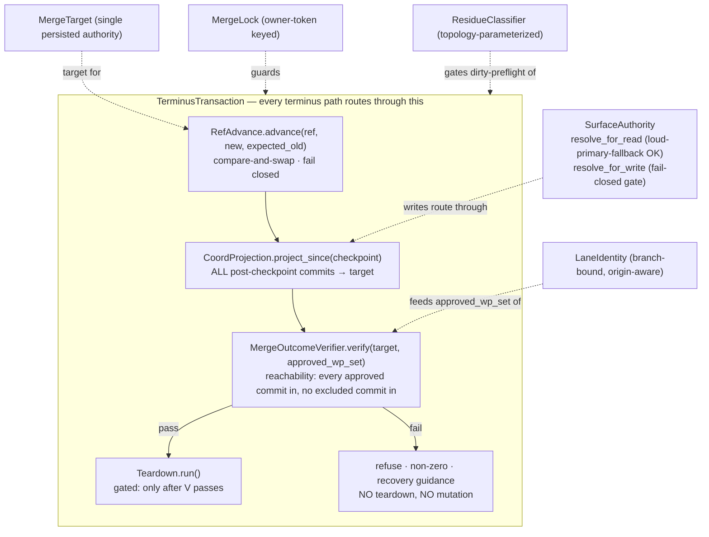

# Implementation Plan: Terminus / Merge-Coord Integrity

**Branch**: `fix/terminus-merge-integrity` | **Date**: 2026-09-23 | **Spec**: [spec.md](./spec.md)
**Input**: Feature specification from `kitty-specs/terminus-merge-integrity-01M380R6/spec.md`
**Grounding**: `work/epic-5001-research/DEBRIEF.md` (+ 4 per-lens research deliverables)

## Summary

Make Epic #5001's invariant executable and **closed by construction**: no terminus command
(`merge` / `merge --resume` / `merge --abort` / `upgrade` / `agent issue-verdict` /
`doctor coordination --fix`) may exit 0 while the target tree diverges from the claimed WP set or
while committed work is destroyed. The root cause is the absence of a transaction boundary around
*advance-ref → project-status → teardown* plus the absence of a post-condition comparing the target
tree to the approved-WP commit set. The technical approach introduces **one shared terminus
transaction seam** every terminus path routes through — CAS ref-advance → full post-checkpoint
projection → fail-closed reachability verifier → gated teardown — backed by four single-authority
consolidations (target, lock, residue-topology, lane-identity) and a surface-authority write gate.

## Technical Context

**Language/Version**: Python 3.11+ (repo standard; `pyproject.toml` `requires-python`)
**Primary Dependencies**: git (porcelain/plumbing via `subprocess`), `spec_kitty_events` (read-only consumer — NOT modified here), no new runtime dependencies
**Storage**: git refs/worktrees; `status.events.jsonl` (append-only log); `.kittify/merge-state.json` (MergeState); `meta.json` / `lanes.json` (mission manifests)
**Testing**: pytest (`tests/`), with per-child red-first reproductions + one Tier-0 property test; ruff + mypy zero-issue gates
**Target Platform**: Linux/macOS CLI (developer tooling)
**Project Type**: single project (`src/specify_cli/` layered adapter)
**Performance Goals**: reconciliation gate is O(#approved-WP-commits), not O(repo history); ≤15% merge wall-clock overhead on the reference mission fixture (NFR-003)
**Constraints**: fail-closed, no auto-mutation on divergence (C-003); changes confined to the true seam set (C-004, **widened per post-plan squad**): `src/specify_cli/{merge,coordination,git,lanes}` **plus** `src/specify_cli/core/paths.py`, `src/specify_cli/tasks/issue_matrix.py`, `src/specify_cli/cli/commands/agent/issue_verdict.py`, `src/specify_cli/status/reducer.py` (wrapper routing only), `src/mission_runtime/…write_target_degrade`, and `CLAUDE.md`/docs; **no shared-package-boundary crossing into `spec_kitty_events`** (C-002) — the Lamport routing fix stays inside `specify_cli`'s wrapper; non-vacuous call-site gate over all 6 terminus entry points (NFR-005)
**Scale/Scope**: 12 in-scope defects; ~7 module surfaces; ~10–12 work packages

### Supply-chain note
No dependencies are added, upgraded, or removed. DIRECTIVE_051 supply-chain posture: N/A for this
mission (no install-time surface changes). Recorded here so silence is not mistaken for an
unexamined default.

## Constitution / Charter Check

*GATE: must pass before Phase 0; re-checked after design.*

| Charter rule | Application | Status |
|---|---|---|
| DIRECTIVE_043 close-by-construction / non-vacuous gate | The reconciliation gate ships with a concrete-floor call-site gate + self-mutation test + shrink-only allowlist so no future terminus path bypasses it | PLANNED (NFR-005) |
| DIRECTIVE_044 single canonical authority / no split-brain | Each of the 4 dual-authority pairs (target, lock, surface, lane-id) collapses to one owner; verifier reads one authoritative surface | PLANNED (C-1..4, S-C) |
| DIRECTIVE_010 spec fidelity | Docs corrected in-band so CLAUDE.md/docstrings stop asserting guarantees the code lacks | PLANNED (FR-013) |
| DIRECTIVE_041/034 test-remediation, red-first | Every child reproduced red-first through its documented entry point before the fix | PLANNED (FR-014, NFR-001) |
| DIRECTIVE_024 locality / DIRECTIVE_025 boy-scout | Edits confined to the merge/coord/git/lanes seams; campsite-clean only touched surfaces | PLANNED (C-004) |
| red-main-release-discipline | These are honest P0s; land failing repros, work them green, never green-wash | ACTIVE |
| Terminology canon (primary/merge/routing footgun) | Name the sense wherever these terms appear in code/docs | PLANNED (C-005) |

No unjustified violations. No complexity-tracking entries required (the seam *reduces* net
divergence rather than adding a layer).

## Architecture — the terminus transaction seam

**Decision (resolves the spec's deferred design question): one `SurfaceAuthority` object with two
entry points, and one `TerminusTransaction` composing the ordered steps.** Details and alternatives
in [research.md](./research.md); entity/contract shapes in [data-model.md](./data-model.md) and
[contracts/](./contracts/).



### Module mapping (where each piece lives)

**Corrected after the post-plan squad** (see [research.md](./research.md) dispositions; real call
sites verified in-tree at HEAD).

| Seam | File(s) | Change |
|---|---|---|
| S-A CAS advance | `src/specify_cli/git/ref_advance.py:410` | `advance_branch_ref` 2-arg → 3-arg CAS (`update-ref ref new old`), fail closed; drop lock-dependence in docstring |
| S-D verifier + gate | `src/specify_cli/merge/reconciliation.py` (NEW), wired in `merge/executor.py` between `_phase_commit_and_assert` (`:1587`) and cleanup; assigns `merge/git_probes.py` (ancestry→tree-equality integration check) | reachability tree-vs-claim; **claim fail-closed + Lamport-sourced + tree-tip SHAs** (D3+); refuse-before-teardown; excluded-commit check by **patch-id** |
| S-B projection + coord CAS + strand heal | `merge/bookkeeping_projection.py:282`, `coordination/teardown.py:125`, `coordination/coherence.py` (heal — sole owner of this file) | project ALL post-checkpoint commits; SHA-scoped revert; teardown gated on reachability |
| S-C surface write gate | **`coordination/write_seam.write_artifact` + `src/mission_runtime/…write_target_degrade.resolve_write_target_or_degrade`** (the real degrade point); consumers `tasks/issue_matrix.py:328`, `cli/commands/agent/issue_verdict.py:129`, `implement.py:_validate_base_ref`; `coordination/surface_resolver.resolve_for_write` = thin helper | refuse degrade-to-primary on WRITE (read path unchanged) |
| C-1 single target | **`core/paths.py resolve_merge_target_branch`**, `merge/resolve.py:284`, `merge/state.py`, `merge/executor.py` (**reseed manifest from `state.target_branch` right after `_load_or_create_merge_state` @ `:2280-2288`**) | persist resolved target; the 28 `lanes_manifest.target_branch` read-sites see it; `--target` beats stale meta on resume |
| C-2 owned lock | `merge/executor.py`, `merge/state.py:370 acquire_merge_lock`, `cli/commands/merge.py:462` | **`owner_token = merge-state-id`** (stable across resume); abort frees only own lock |
| C-3 residue topology | `coordination/coherence.py:155-158`, `merge/executor.py` dirty gate (`:2178-2210`) | thread stored topology into `is_coord_residue_churn` |
| C-4 lane identity | `lanes/compute.py:515-537` (mint stable id once, **read back** on finalize — never re-letter over a bound id), `workspace/context.py` | branch-bound stable id; consult `origin/<lane>` |
| FR-011 behind-HEAD | `merge/preflight.py` / resume remedy classifier; `merge/git_probes.py:31-54` (ancestry-only integration check) | distinguish behind-HEAD from local changes |
| FR-012 legacy | reconciliation entry | detect+refuse pre-fix in-flight state |
| FR-013 docs | `CLAUDE.md`, `git/ref_advance.py:18-24` docstring, ADR `2026-02-09-3` reconciliation note (keep #4990 named-open) | correct false guarantees |

## Project Structure

### Documentation (this mission)
```
kitty-specs/terminus-merge-integrity-01M380R6/
├── plan.md · research.md · data-model.md · quickstart.md · contracts/
└── tasks.md            # created by /spec-kitty.tasks
```

### Source Code (repository root)
```
src/specify_cli/
├── git/ref_advance.py                    # S-A CAS advance
├── merge/
│   ├── reconciliation.py   (NEW)         # S-D verifier + gate
│   ├── executor.py                       # wire gate; owned lock; single target
│   ├── state.py · resolve.py             # C-1 persisted target
│   ├── bookkeeping_projection.py         # S-B projection
│   └── preflight.py                      # FR-011 behind-HEAD
├── coordination/
│   ├── surface_resolver.py               # S-C write gate
│   ├── teardown.py · coherence.py        # S-B gating; C-3 topology
├── lanes/compute.py · workspace/context.py  # C-4 lane identity
└── tasks/issue_matrix.py                 # S-C write consumer

tests/
├── merge/ · coordination/ · git/ · lanes/   # per-child repros + unit
└── <property>/ terminus reconciliation Tier-0 property test
```

**Structure Decision**: single-project layered adapter (existing). The one new file is
`merge/reconciliation.py` (the verifier + gate); everything else is a change to an existing seam,
honoring locality (C-004).

## Parallel Work Analysis

**Corrected after the post-plan squad.** `merge/executor.py` (2663 lines) is a god-*file* already
decomposed into ~50 `_phase_*` functions over one `_MergeRunState` dataclass — it is NOT decomposed
further (out-of-domain, DIRECTIVE_024, would rewrite every hunk the fix needs). Instead: a **scaffold
WP** lands all new `_MergeRunState` fields + the linear-caller phase slot + a `reconciliation.py`
stub in ONE change, then a **single serialized executor lane** carries every edit to `executor.py` /
`coherence.py`. Everything file-isolated runs in a true parallel fan.

### WP DAG (nodes + dependency edges; /spec-kitty.tasks materializes this)
```
Parallel fan (file-isolated, start immediately):
  WP01  F1  Tier-0 property + per-child repro harness (red-first, real CLI entry, no git mocks)
  WP02  F2  S-A CAS ref-advance          → git/ref_advance.py
  WP03      S-C surface WRITE gate         → write_seam, mission_runtime/write_target_degrade,
                                             issue_matrix.py, issue_verdict.py, implement.py, surface_resolver.py
  WP04      C-4 stable/origin-aware lane id→ lanes/compute.py, workspace/context.py
  WP05      FR-011 behind-HEAD remedy      → merge/preflight.py, merge/git_probes.py(read)
Serialized executor lane (one owner; each ← previous):
  WP06  scaffold: _MergeRunState fields + phase slot + reconciliation.py stub  ← WP01
  WP07  S-D verifier + reconciliation gate (claim fail-closed+Lamport+tree-tips; patch-id excluded; git_probes tree-eq) ← WP06, WP02
  WP08  S-B projection + coord-CAS + SHA-scoped strand heal (coherence.py heal) ← WP07
  WP09  C-1 single persisted target (core/paths.py + manifest reseed)          ← WP08
  WP10  C-2 owned lock (owner_token=merge-state-id)                            ← WP09
  WP11  C-3 topology-aware residue (coherence.py classifier)                   ← WP10
Integration:
  WP12  FR-012 legacy refuse + FR-013 docs + final green (12 repros + blast radius) ← all
```

### Ownership map (file globs per WP — guarantees no two concurrent WPs share a writer)
- The only multi-writer files — `merge/executor.py` and `coordination/coherence.py` — are confined
  to the **single serial lane** (WP06–WP11). No parallel-fan WP touches them.
- WP03 owns `coordination/write_seam.py`, `src/mission_runtime/**/write_target_degrade*`,
  `tasks/issue_matrix.py`, `cli/commands/agent/issue_verdict.py`, `implement.py`,
  `coordination/surface_resolver.py`. WP04 owns `lanes/compute.py`, `workspace/context.py`.
  WP05 owns `merge/preflight.py` (+ read-only `git_probes.py`). WP02 owns `git/ref_advance.py`.
  Disjoint — full parallelism.

### Work distribution
- **Critical path**: WP06 scaffold → WP07 S-D → WP08 S-B (→WP09→WP10→WP11). WP02 (CAS) is in the
  fan but MUST merge before WP07 starts (S-D pairs with atomic advance).
- **Agent assignments**: `python-pedro` implements; `reviewer-renata` reviews each WP. The serial
  lane is one implementer end-to-end to keep `_MergeRunState` coherent.

### Coordination points
- **Integration test**: WP01's Tier-0 property test is the shared gate — red before, green after the
  serial lane + companions land. Per-child repros drive the real CLI entry point (no `_run_git`
  mocking) so they exercise `ref_advance.py:410`'s CAS for real.
- **Sequencing guard**: WP09/WP10/WP11 edit `executor.py`; they are strictly ordered, never
  concurrent, so `_MergeRunState` never has two simultaneous writers.

## Complexity Tracking
*No Constitution violations to justify — the seam consolidates authority and removes divergence.*
