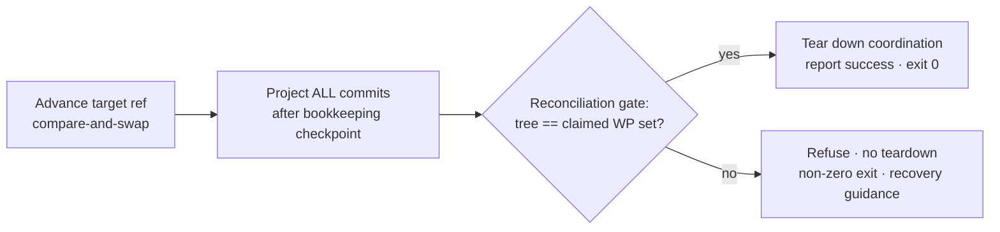

# Mission Specification: Terminus / Merge-Coord Integrity

**Mission Branch**: `fix/terminus-merge-integrity`
**Created**: 2026-09-23
**Status**: Draft
**Input**: Make Epic #5001's invariant executable and closed-by-construction across the terminus/merge-coordination surface. Grounding: `work/epic-5001-research/DEBRIEF.md` (4-lens research squad synthesis).

## Context

Epic #5001 names a release-blocking class: an ordinary terminus command — `merge`,
`merge --resume`, `merge --abort`, `upgrade`, `agent issue-verdict`, or
`doctor coordination --fix` — **destroys committed work** (mission code and/or canonical
status/verdict rows), **fabricates success** (WPs marked done/accepted), and **exits 0**, with the
reworked lanes/branches already deleted so recovery is only via `git reflog` / `git fsck
--unreachable`. A 4-lens research squad found these 12 in-scope defects share **one meta-root**:
there is no enforced transaction boundary around *advance-target-ref → project-status → tear-down*,
and no post-condition that the target tree equals the claimed WP set. The exit code trusts a derived
envelope the same run wrote (status rows / meta fields) instead of the git tree.

This mission makes the epic's invariant **executable and closed-by-construction** (one shared
verification + compare-and-swap seam every terminus path routes through), not 14 per-site patches.

**In scope (12 children):** #4945, #4969, #4970, #4973, #4977, #4978, #4981, #4982, #4985, #4991,
#4996, #4997.
**Explicitly out of scope (spun out as sequenced sibling missions):** #4990 (reducer wall-clock LWW
→ needs the cross-repo `spec_kitty_events` Lamport reducer + ADR 2026-02-09-3) and #4972 (`upgrade`
per-branch stamping — different subsystem).

### The honest terminus transaction (product intent)

Today only steps A (non-atomically) and a partial B exist; step C does not exist at all, and D runs
regardless of C. This mission adds C, makes A atomic, completes B, and gates D behind C.

## User Scenarios & Testing *(mandatory)*

### User Story 1 - A terminus command is honest by construction (Priority: P1)

As an operator or agent, when I run any terminus command, it **never reports success while the
target tree diverges from what the WP status/manifest claims** — it fails closed with an accurate,
non-zero outcome and a recovery instruction instead of deleting my lanes and exiting 0.

**Why this priority**: This is the epic invariant and the MVP. The Terminus Reconciliation Gate +
compare-and-swap advance alone convert ~9–10 of the 12 defects from "exit 0 + destroyed work" into
honest fail-closed outcomes. Everything else is defence-in-depth around it.

**Independent Test**: A single Tier-0 property test — "after any exit-0 terminus command, every
approved WP's approved commits are reachable from the target and no excluded commit is" — is red
against pre-fix behavior for #4945/#4977/#4981/#4991/#4996/#4997 and green after, from one entry
point.

**Acceptance Scenarios**:

1. **Given** a merge whose bookkeeping claims WP03 is done, **When** WP03's approved commits are not
   reachable from the target, **Then** the command refuses, exits non-zero, tears down nothing, and
   names the divergence.
2. **Given** a genuinely-correct merge, **When** it completes, **Then** it exits 0 with the same
   success contract as today (no happy-path regression).
3. **Given** a canceled or removed WP whose code is only reachable through a dependent lane's
   history (#4977/#4945), **When** merge runs, **Then** the gate detects the extraneous commits and
   refuses rather than landing them and exiting 0.

---

### User Story 2 - Concurrent committed work survives a merge (Priority: P1)

As a teammate or reviewer whose status emit / acceptance verdict committed to the coordination ref
*during* a merge, my committed work is **projected onto the target before any teardown** and the
target ref advances only under compare-and-swap — so my commit is never left reachable only via
`fsck --unreachable`.

**Why this priority**: Silent destruction of concurrent committed work (#4981, #4973) and the
non-atomic ref advance that lets a second mission's landed code be rewound off the target (#4996)
are the most dangerous data-loss paths.

**Independent Test**: Reproduce a concurrent coord-ref commit between the bookkeeping checkpoint and
teardown; assert it is reachable from the target after the merge and that a changed coord tip aborts
teardown.

**Acceptance Scenarios**:

1. **Given** a commit appended to the coordination ref after the bookkeeping checkpoint, **When**
   merge reaches teardown, **Then** that commit is projected onto the target first and teardown is
   gated on the projection + reachability check succeeding (#4981).
2. **Given** a forward advance of a target/coord ref, **When** the ref's value changed since it was
   read, **Then** the advance fails closed instead of overwriting (#4996).
3. **Given** a heal/repair that rewrites the append-only status log, **When** it runs, **Then** it
   reverts only explicitly recorded SHAs and never a range that erases a third party's later event
   (#4973).

---

### User Story 3 - A stale or fresh clone cannot overwrite the authoritative surface (Priority: P2)

As a teammate running `agent issue-verdict` or `implement` from a fresh clone or CI checkout whose
coordination worktree is not materialized, a terminus **write** fails closed rather than reading my
empty/stale primary directory and committing it over the coordination branch (deleting other
teammates' recorded verdicts/rows).

**Why this priority**: A wrong-surface write corrupts the very log the reconciliation gate trusts,
so it must be closed independently (#4970, #4969).

**Independent Test**: From a checkout with an unmaterialized coord worktree, attempt a coord-surface
write; assert it refuses with guidance instead of overwriting the committed surface.

**Acceptance Scenarios**:

1. **Given** an unresolved/unmaterialized authoritative coord surface, **When** a terminus write is
   attempted, **Then** it refuses instead of degrading to the primary directory (#4970).
2. **Given** an approved lane that exists only as `origin/<lane>`, **When** `implement` resolves the
   lane base, **Then** it consults the origin ref so the teammate's approved code is not shadowed by
   a fresh branch cut from local main (#4969).

---

### User Story 4 - Resume/abort/target land where I chose and respect other merges (Priority: P2)

As an operator, `--resume` lands the mission on the branch I originally chose (persisted, not stale
meta), an explicit `--target` is honored across a crash, and `--abort` never frees a *different*
mission's live merge lock.

**Why this priority**: Landing on an unchosen branch (#4985/#4991) and freeing a live lock so a
concurrent merge is rewound off the target (#4996 second half) both destroy work and exit 0.

**Independent Test**: Crash a `merge --target develop`, `--resume` it, assert it lands on `develop`
(not meta's main). Start two merges; `--abort` one; assert the other's lock is untouched.

**Acceptance Scenarios**:

1. **Given** a merge started with `--target develop` that crashed, **When** `--resume` runs, **Then**
   it merges into `develop`, the persisted target, not meta's default (#4991/#4985).
2. **Given** two missions merging concurrently, **When** one is aborted, **Then** abort releases
   only the lock its own invocation owns and never the live merge's (#4996).

---

### User Story 5 - Merge never destroys my planning artifacts or an interrupted checkout (Priority: P3)

As an operator on a lanes/single_branch mission, merge does not misclassify my uncommitted planning
artifacts (issue-matrix, traces, decisions, status log) as coordination residue and `reset --hard`
them; and after an interrupted merge, the recovery never advises a "Commit" that reverts an
already-integrated lane.

**Why this priority**: Destroying uncommitted planning work (#4978) and the behind-HEAD "Commit"
trap (#4982/#4997) are lower-frequency but still silent-loss paths.

**Independent Test**: Run merge on a lanes/single_branch mission with dirty planning artifacts;
assert they survive. Interrupt a merge so the checkout is behind its own HEAD; assert the recovery
distinguishes that from real local changes.

**Acceptance Scenarios**:

1. **Given** a lanes/single_branch mission with dirty planning artifacts, **When** merge's dirty
   preflight runs, **Then** it classifies churn using the mission's actual topology and does not
   destroy them as coord residue (#4978).
2. **Given** a checkout merely behind its own HEAD after an interrupted merge, **When** resume
   inspects it, **Then** it does not advise committing the lane's own already-merged files (which
   would revert the merge) (#4982/#4997).

---

### Edge Cases

- A concurrent status emit / `issue-verdict` commits to the coordination ref between the bookkeeping
  checkpoint and teardown.
- Two reviewers approving/rejecting one WP from two checkouts (verdict-authority; note: the reducer
  ordering fix is #4990, out of scope — this mission must not regress it, but does not fix it).
- `reset --hard` blocked by `index.lock`, or the merge process killed mid-transaction.
- A fresh CI clone with an unmaterialized coordination worktree.
- A second concurrent mission's merge running when `--abort` is typed.
- A WP removed followed by a `finalize-tasks` re-run that re-letters surviving lanes; a canceled WP
  whose code is in a dependent lane's history.
- A pre-fix in-flight `MergeState` / coordination branch encountered by the new fail-closed code.

## Requirements *(mandatory)*

### Functional Requirements

| ID | Title | User Story | Priority | Status |
|----|-------|------------|----------|--------|
| FR-001 | Terminus Reconciliation Gate: before any branch/worktree teardown, verify every approved WP's approved commits are reachable from the target and no excluded (canceled/removed) commit is; refuse on failure. Traces #4945 #4977 #4981 #4991. | US1 | High | Open |
| FR-002 | Exit-code honesty: a terminus command exits non-zero with an accurate outcome whenever the target tree diverges from the claimed WP set; it never prints success or exits 0 over a divergent tree. Traces all in-scope. | US1 | High | Open |
| FR-003 | Compare-and-swap ref advance: every forward advance of a target or coordination ref is conditioned on its expected prior value and fails closed if it changed. Traces #4996 #4982 #4997. | US2 | High | Open |
| FR-004 | Projection-before-teardown: coordination teardown is preceded by projecting ALL commits made on the coord ref after the bookkeeping checkpoint onto the target, and is gated on that projection plus a reachability check succeeding. Traces #4981 #4970 #4973. | US2 | High | Open |
| FR-005 | Content-scoped strand heal: any repair that rewrites the append-only status log operates on explicitly recorded SHAs only, never a range revert that can erase a third party's later event. Traces #4973. | US2 | High | Open |
| FR-006 | Surface-authority write gate: a terminus WRITE to the coordination surface fails closed when the authoritative coord worktree/branch is unresolved or unmaterialized, instead of degrading to an empty/stale primary view. Traces #4970 #4969. | US3 | High | Open |
| FR-007 | Single persisted merge target: the landing branch is resolved once and persisted as the sole authority for all phases and for `--resume`; an explicit `--target` is honored across a crash and never overridden by stale meta. Traces #4985 #4991. | US4 | High | Open |
| FR-008 | Owned merge lock: the merge lock is keyed/owned so `--abort` releases only a lock the aborting invocation owns and can never free a different mission's live merge. Traces #4996. | US4 | High | Open |
| FR-009 | Topology-aware residue classification: the dirty-tree preflight classifies working-tree changes using the mission's actual topology; planning artifacts on lanes/single_branch missions are never destroyed as coordination residue. Traces #4978. | US5 | Medium | Open |
| FR-010 | Stable lane identity: a lane's identity is bound to its git branch at creation and never re-derived positionally; base resolution consults `origin/<lane>` so a teammate's pushed approved lane is not shadowed. Traces #4945 #4969. | US4 | Medium | Open |
| FR-011 | Behind-HEAD recovery guidance: when a checkout is merely behind its own HEAD after an interrupted terminus, the command distinguishes that from real local changes and never advises a "Commit" that reverts an already-integrated lane. Traces #4982 #4997. | US5 | Medium | Open |
| FR-012 | Forward-only legacy handling: pre-fix in-flight `MergeState`/coord state is detected and refused with a recovery instruction; the new guarantees are not retro-applied to auto-heal it. | US1 | Medium | Open |
| FR-013 | Doc/doctrine correction (in-band): correct CLAUDE.md's compare-and-swap-advance and "sole-authority deterministic reducer" claims, the `git/ref_advance.py` docstring, and reconcile the referenced guarantees with ADR 2026-02-09-3. | US1 | Medium | Open |
| FR-014 | Red-first reproduction: a Tier-0 property test asserting the invariant across terminus commands lands red-first against pre-fix behavior, plus a per-child reproduction for each of the 12. | US1 | High | Open |

### Non-Functional Requirements

| ID | Title | Requirement | Category | Priority | Status |
|----|-------|-------------|----------|----------|--------|
| NFR-001 | Defect closure | 12/12 in-scope defect reproductions are red before the fix and green after, each driven through its documented entry point. | Reliability | High | Open |
| NFR-002 | Zero committed-work loss | Across the full test matrix, 0 terminus operations delete a branch/worktree whose reachable-only commits were not first projected onto the target (0 commits recoverable only via `reflog`/`fsck`). | Data-safety | High | Open |
| NFR-003 | Gate is bounded | Reconciliation-gate overhead is O(number of approved WP commits), not O(repository history), and adds ≤15% to merge wall-clock on the reference mission fixture. | Performance | Medium | Open |
| NFR-004 | Happy-path parity | A genuinely-correct merge retains an identical success exit-code and output contract; existing passing merge tests remain green with no semantic change. | Compatibility | High | Open |
| NFR-005 | Non-vacuous gate | The reconciliation seam is enforced by a non-vacuous call-site gate (concrete floor + self-mutation test + shrink-only allowlist) so a future terminus path cannot silently bypass it (DIRECTIVE_043). | Maintainability | High | Open |

### Constraints

| ID | Title | Constraint | Category | Priority | Status |
|----|-------|------------|----------|----------|--------|
| C-001 | Close by construction | The fix is one shared verification + compare-and-swap seam that every terminus path routes through — not per-site patches (DIRECTIVE_043, single-canonical-authority). | Technical | High | Open |
| C-002 | Scope boundary | Do not modify the `spec_kitty_events` reducer (#4990) or the `upgrade` stamper (#4972); do not cross the shared-package boundary into the events package. These are separate missions. | Scope | High | Open |
| C-003 | Fail-closed, no auto-mutation | On detected divergence: refuse + non-zero exit + recovery guidance; never auto-mutate a divergent tree (resolved Decision Moment). | Behavioral | High | Open |
| C-004 | Locality | Code changes stay within `src/specify_cli/{merge,coordination,git,lanes}` and the named docs/ADR; respect existing module seams (architectural-alignment). | Architectural | Medium | Open |
| C-005 | Terminology | Use canonical Mission terminology; when naming `primary`/`merge`/`routing`, name the specific sense (glossary footgun canon). | Regulatory | Medium | Open |

### Key Entities

- **Terminus command**: any command that can advance the target and tear down coordination — `merge`, `merge --resume`, `merge --abort`, `upgrade`, `agent issue-verdict`, `doctor coordination --fix`.
- **Target ref**: the branch that must, after the command, reflect exactly what landed.
- **Approved WP commit set**: the claim (from status/manifest) the target tree is verified against.
- **Coordination surface**: the authoritative status/verdict branch + worktree; the single source the gate trusts.
- **Bookkeeping checkpoint**: the coord-ref state captured before projection; commits after it must be projected before teardown.
- **MergeState**: persisted merge progress, including the single resolved landing target and owned-lock identity.
- **Reconciliation gate**: the fail-closed post-condition that compares target tree to the approved WP commit set before teardown.

## Success Criteria *(mandatory)*

### Measurable Outcomes

- **SC-001**: 0 terminus invocations exit 0 while the target tree diverges from the claimed WP set, measured across the per-child repro matrix and the Tier-0 property test.
- **SC-002**: 12/12 in-scope defect reproductions (#4945 #4969 #4970 #4973 #4977 #4978 #4981 #4982 #4985 #4991 #4996 #4997) pass after the fix, each red before it.
- **SC-003**: 0 instances of approved-WP committed work becoming reachable only via `git reflog`/`fsck` after a terminus command in the test matrix.
- **SC-004**: 100% of terminus commands that detect divergence produce a non-zero exit and a recovery instruction that names the divergence.
- **SC-005**: The happy-path merge success contract is unchanged — the existing passing merge test suite stays green with no semantic edits.

## Assumptions

- The architectural shape of the shared seam (a single `SurfaceAuthority` object vs a write-fence + read-resolver pair; where exactly the `MergeOutcomeVerifier` port is homed) is deferred to `/spec-kitty.plan`; this spec fixes the *behavioral contract*, not the class layout.
- The 12 in-scope children ship reproducible harnesses/fixtures per the research debrief; the plan will lift them into the test suite red-first.
- `spec_kitty_events` verdict-reducer ordering (#4990) remains as-is; this mission must not regress it and does not depend on its fix landing first.
