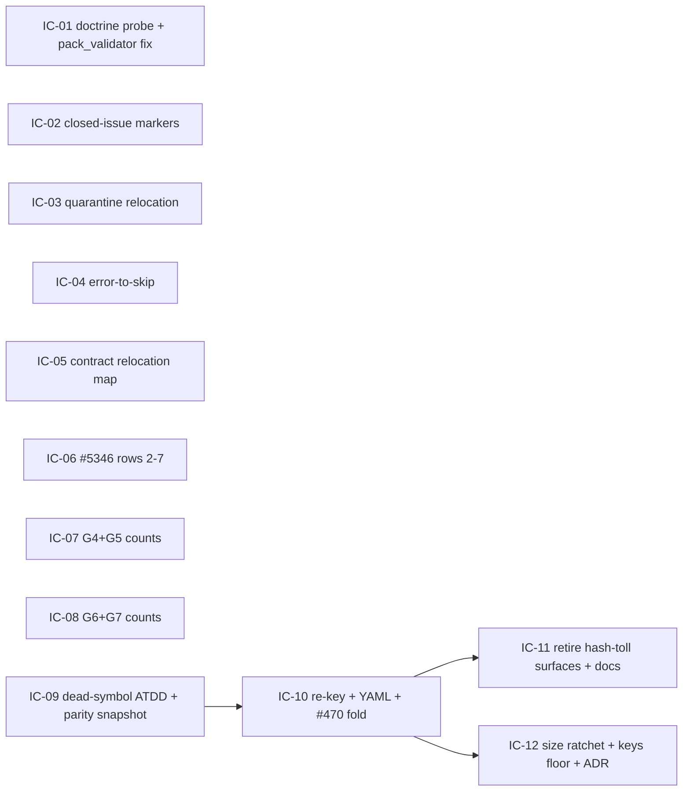

# Implementation Plan: Test-suite remediation: masked greens and pin honesty

**Branch**: `issue-5353-test-suite-remediation` | **Date**: 2026-09-30 | **Spec**: [spec.md](spec.md)
**Input**: Mission specification from `kitty-specs/test-suite-remediation-01M3SSDW/spec.md`

Parent: #5353. Addresses: #5346.

**Note**: This template is filled in by the `/spec-kitty.plan` command. See `packs/built-in/missions/mission-steps/software-dev/plan/prompt.md` for the execution workflow.

The planning questions are answered. The binding answers are:

- the four decision moments `DM-01M3SSEK`, `DM-01M3SSRY`, `DM-01M3SSV4` and `DM-01M3SVDP` (under `decisions/`);
- the orchestrator rulings in `traces/design-decisions.md`, restated as R1–R6 in [research.md](research.md).

This plan does not re-open them.

## Summary

The mission makes a green run mean what it says. It works on two tracks.

1. **Masked greens (FR-001..FR-005).** Some tests report success without executing the assertion that guards their contract. The mission makes them run, fail honestly, or retire behind a named covering guard:
   - nine doctrine-probe tests skip on a stale path probe;
   - skip or xfail markers rest on closed issues;
   - five quarantined accept-diagnose tests run in no CI lane (in fact the whole file runs in none);
   - some fixtures turn build or metadata errors into skips;
   - ten contract round-trips skip forever on relocated modules.

   Unmasking surfaces one real product defect. `pack_validator._collect_fragment_edge_intent` ignores intent declared in `drg/fragment.yaml` and emits a spurious `same_id_collision` advisory. It is fixed red-first, in its own commit.
2. **Pin honesty (FR-006..FR-009, FR-011).** The exemption data currently held in the test source is converted to invariant forms:
   - the seven #5346 pins;
   - the recurring exact-count class (pin-inventory F3–F12);
   - the dead-symbol allowlist keyed by function-body hash.

   The main structural change re-keys the dead-symbol allowlist:
   - Its identity becomes `(module, name)`.
   - It moves into a schema-validated `tests/architectural/dead_symbol_allowlist.yaml`, loaded by `tests/architectural/_dead_symbol_allowlist.py`.
   - The #470 widened-scope grandfather list folds into the same file, so the gate has one exemption authority.
   - The refresh helper and `SymbolKey.source_module` are retired.
   - A size-ratchet row restores charter Burn-down (a).
   - One ADR in `docs/adr/4.x/` records the change.

**No census gate is added** (C-008, ADR 2026-09-14-1, DM-01M3SVDP). Each converted pin is guarded by its own invariant-form test.

## Technical Context

**Language/Version**: Python 3.11+ (the repository floor; CI runs 3.11–3.13 interpreter shards nightly).

**Primary Dependencies**:
- `pytest` (with `pytest-xdist` for the lane checks) and `typer.testing.CliRunner` / `click` for the accept-CLI tests;
- PyYAML (`yaml.safe_load`, as used by `_baselines.yaml`, `inline_meta_read_allowlist.yaml` and `charter_path_literal_allowlist.yaml`) for the new allowlist loader. It uses a duplicate-key-rejecting `SafeLoader` subclass; see the contract.
- stdlib `ast`/`tokenize`, through the existing `tests/architectural/_ast_scan.py` and `_symbol_key.py` runtime hashing;
- `packaging.version` for the version-monkeypatch test;
- `hatchling` / `build` (declared `test` extras) for the wheel fixtures.

**Storage**: Files only:
- `tests/architectural/dead_symbol_allowlist.yaml` (new);
- `tests/architectural/_baselines.yaml` (one new leaf);
- the evidence records under `kitty-specs/test-suite-remediation-01M3SSDW/evidence/`. WPs report their evidence records in their review notes and final report; the orchestrator materializes them under `kitty-specs/test-suite-remediation-01M3SSDW/evidence/` at closeout (tasks.md "Closeout (orchestrator)"). No code WP writes a `kitty-specs/` path.

**Testing**:
- Named-file pytest runs only (C-001, `NO_FULL_HEAVY_SUITES_IN_MISSION`): `uv run --frozen pytest <files> -n0 -q -rs`.
- Never `tests/architectural/` as a directory, never `make test-full`, and no stress, timing, e2e or performance suite. The one exception needs a ruling; see Risk RK-3.
- `make test-fast` is the shared baseline for each concern.
- Every FIX carries a planted break, reverted and never committed (C-007). Every RETIRE names a covering guard that goes red on the same break (C-002, FR-011).

**Target Platform**: The spec-kitty repository test suite on Linux CI:
- the per-PR module matrix, via `ci-router.yml` → `module-tests.yml` / `ci-modules.yml`;
- the nightly lanes, `ci-nightly.yml`, including the `specify-cli-out-of-matrix` job;
- local developer runs on Linux, macOS and Windows. The platform guards stay (the FR-004 exemption list).

**Project Type**: single (Python CLI plus its test tree).

**Performance Goals**:
- `tests/architectural/test_no_dead_symbols.py` wall time must not grow; about 230 s today. The YAML load is a few hundred entries, so it is negligible.
- The re-keyed gate keeps runtime hashing only for keyability and the auto-exempt collision guard.
- No new gate adds collection-time cost.

**Constraints**:
- C-001: named files only.
- C-002: no retirement without a proven guard.
- C-003: shrink-only ratchets; no loosening, no new suppressions.
- C-005: product change only for FR-005 or a minimal supporting seam, red-first and in its own commit.
- C-006: archived `kitty-specs/` are immutable. Hence the test-side contract relocation map.
- C-007: planted breaks never land.
- C-008: no census gate.
- NFR-005: 0 new ruff, format or mypy findings, and complexity ≤ 15.
- Files in `pyproject.toml [tool.ruff.format].exclude` are edited **without** running `ruff format` on them. Reformatting would force an exclude-list removal (`test_ruff_format_exclude_ratchet.py`) and make `pyproject.toml` a shared conflict file.

**Scale/Scope**:
- 18 masked-green inventory rows (masked-greens.md): 9 probe tests, 5 quarantined tests plus the 23-test file, 6 closed-issue guard sites, and 11+3+1+1+3 error-to-skip sites.
- 10 contract round-trips.
- 7 #5346 rows, and 10 FR-007 class rows (F3–F12) over 13 test files.
- 293 dead-symbol allowlist entries (from 294 literals) and 91 widened #470 entries.
- About 55 files touched; 1 product source file (`src/specify_cli/doctrine/pack_validator.py`); 1 ADR.

## Charter Check

*GATE: Must pass before Phase 0 research. Re-check after Phase 1 design.* Re-checked after Phase 1: **PASS**, with three flags (F-1..F-3) routed to the orchestrator as risks.

| Charter rule | How this plan meets it | Verdict |
|---|---|---|
| **Single canonical authority** (Governing Principles; **DIRECTIVE_044** canonical sources and unification) | <ul><li>The #470 widened list folds into the same YAML: one exemption authority per gate (R2).</li><li>The allowlist size lives **only** in `_baselines.yaml`, never also in the YAML data (research §8.2 anti-pattern).</li><li>Pin conversions remove the double entry of "add a member AND bump a count".</li><li>Canonical templates are used, and no earlier mission is copied.</li></ul> | PASS |
| **Architectural alignment** (DIRECTIVE_001) | <ul><li>No layer or package boundary changes.</li><li>The FR-005 fix stays inside `pack_validator` and reuses the org-fragment loader `_validate_org_fragment` already uses.</li><li>No new product module.</li></ul> | PASS |
| **ATDD-first** (C-011 section; Standing Order 4) | Each concern names its red-first commit or planted break (IC map below). The dead-symbol ATDD pins (IC-09) land before the re-key (IC-10). **C-011 reading (analysis D1, recorded in `traces/design-decisions.md`, 2026-09-30 "Rulings on the analysis findings"):** <ul><li>Product-code changes (the WP01 `pack_validator` fix and any FR-005 fix) take the strict form: a failing-first test commit, red on base and green at the WP's final commit.</li><li>Test-only WPs, where the test is the deliverable: the red→green proof is the planted-break protocol (red on the planted defect, green on the real code; the break is never committed, C-007).</li><li>The dead-symbol chain: WP10 commits its acceptance tests as strict xfails (`raises=`-bounded; D2 ruling, which does not loosen C-003 because the markers flip to a failure on XPASS); WP11 commits its loader tests failing-first, before the loader; WP12 flips the WP10 tests green.</li></ul>This is an interpretation, not a new exception. | PASS |
| **DIRECTIVE_041** Tests as scaffold, not friction | This is the mission's core. Masked greens are unmasked (US1), and body-hash and count pins become invariant forms (US2). | PASS |
| **DIRECTIVE_043** Close defect classes by construction; `architectural-gate-non-vacuity`; `frozen-baseline-shrink-only-ratchet` | <ul><li>The re-keyed gate keeps a concrete corpus floor (≥ 3,500 `__all__` names, ≥ 600 modules), the M1–M13 self-mutation battery, an authority-parse check (M11) and a shrink-only size cap (new `_baselines.yaml` leaf).</li><li>The destructive-op baseline and the inert-slot ceiling stay as ratchets (R3).</li><li>A gate-unmask cannot self-validate. Every conversion carries a planted violation that turns red.</li></ul> | PASS |
| **DIRECTIVE_046** Readable, consistent PRs | <ul><li>Logically sliced commits: one ATDD commit, one fix commit per concern, and the FR-005 product fix in its own commit.</li><li>A linear rebase onto `upstream/main`.</li><li>Scope finished in-mission. Deferrals only as tracked follow-ups with a rationale (see research.md D-14).</li></ul> | PASS |
| **Standing Order 1**: adversarial squad | Three profile-loaded research lenses covered the post-spec and brownfield point-cuts. A post-tasks squad is advisory and recommended. | PASS (advisory) |
| **Standing Order 2**: campsite and tidy-first | The tidy steps come first, inside the owned file set, for example: <ul><li>hoist the stress budget constant (S1192);</li><li>delete the changelog docstrings on the compat and bridge tests;</li><li>delete the dead `_build_wheel_fallback`.</li></ul> The file set is not grown. Locality is the brake. | PASS |
| **Standing Order 3**: tracer files | `traces/{approach,design-decisions,tooling-friction}.md` are seeded. Each concern appends to them. | PASS |
| **Standing Order 5 / `NO_FULL_HEAVY_SUITES_IN_MISSION`** | Every concern lists named files only (quickstart.md). | **FLAG F-1**: see RK-3. The stress-budget split cannot run its own planted break without a stress/timing run. |
| **Standing Order 8**: mission hygiene | <ul><li>New issues get issue-matrix rows: the FR-005 defect, the #3113 residual and any follow-up.</li><li>#5346 is claimed and assigned to the HiC (Tracker Ticket Assignment Rule).</li><li>Reviewer ≠ implementer.</li></ul> | PASS (action at implement) |
| **Standing Order 9**: red-main discipline | <ul><li>The #3113 residual stays a **strict** xfail on an open issue (honest red).</li><li>No real defect is re-masked.</li><li>Pre-existing reds are classified, never green-washed.</li></ul> | PASS |
| **Burn-down Policy (a)**: every mutable architectural allowlist is capped in `_baselines.yaml` | The dead-symbol allowlist gets its first cap (IC-12). That repairs today's charter drift. | PASS (improves) |
| **`__all__` convention (C-007)**: the dead-symbol gate walks `__all__` | The gate file name, the `architectural` marker and its real asserts are kept. It is not renamed (R2). | PASS |
| **Governance → major architectural change needs an ADR** | IC-12 writes ADR `docs/adr/4.x/2026-MM-DD-N-dead-symbol-allowlist-module-name-identity.md`. It partially supersedes D-1 of `relocation-hardened-dead-code-scanners-01KX958P`. | PASS |
| **ADR 2026-09-14-1** (census/floor ratchet adjudication) | No census gate is added (C-008). Pins are converted per site. | PASS |
| **Pre-existing Failure Reporting Rule** | Any red that is not attributable to the mission is classified with the baseline-red gotcha and filed before it is accepted. | PASS (action) |
| **Terminology canon** | New prose says Mission, and new identifiers do not use `feature`. Existing fixture identifiers are not renamed; that is out of scope, and nothing new is introduced. | PASS |
| **Pack tiers** | No `packs/` file is touched, so the pack-manifest regeneration is not triggered. | N/A |
| **Code quality** (NFR-005, Sonar S3776/S1192) | The loader and converters stay at complexity ≤ 15 and hoist repeated literals. Format-excluded files are not reformatted. | PASS |
| **NFR-001** (no coverage loss per remediated file) | **FLAG F-2**: see RK-1. Taken literally, it conflicts with the RETIRE dispositions (C-002) in IC-06/07/08/11. | FLAG |
| **FR-003 lane destination** | **FLAG F-3**: see RK-2. The destination must remain out-of-matrix. | FLAG (verify) |

## Project Structure

### Documentation (this mission)

```
kitty-specs/test-suite-remediation-01M3SSDW/
├── spec.md                      # source of truth (amended at plan time; not edited here)
├── plan.md                      # this file
├── research.md                  # Phase 0: decisions, pin and masked-green dispositions
├── data-model.md                # Phase 1: allowlist schema, inventory and evidence records
├── quickstart.md                # Phase 1: reviewer verification per FR
├── contracts/
│   └── dead-symbol-allowlist.md # Phase 1: loader + gate contract, M1–M13, floor
├── research/                    # the three lens reports (inputs, consolidated by research.md)
├── traces/                      # tracer files (appended during implementation)
├── decisions/                   # DM records
├── evidence/                    # FR-011; materialized by the orchestrator at closeout from WP-reported records
│   ├── IC-NN-<slug>.md
│   └── dead-symbol-parity/{before.json,after.json}
└── tasks.md                     # Phase 2 (/spec-kitty.tasks), not created here
```

### Source Code (repository root)

The paths this mission touches, grouped by the concern that owns them. Ownership is disjoint across concerns.

```
src/specify_cli/doctrine/pack_validator.py                                  IC-01 (product fix, own commit)

tests/specify_cli/doctrine/test_pack_validator.py                           IC-01
tests/integration/test_quickstart_end_to_end.py                             IC-01

tests/architectural/test_egress_consent_boundary.py                         IC-02
tests/migration/test_teamspace_migration_rehearsal.py                       IC-02
tests/migration/test_mission_state_repair.py                                IC-02
tests/integration/migration/test_mission_state_repair_fidelity_e2e.py       IC-02
tests/doctrine/test_packaging_parity.py                                     IC-02
tests/integration/test_clean_install_next.py                                IC-02
tests/_support/shared_package_deferral.py                    (delete)       IC-02
tests/architectural/test_saas_sync_gate_selection_invariance.py             IC-02

tests/cross_cutting/misc/test_acceptance_support.py  ->
tests/specify_cli/acceptance/test_acceptance_support.py      (git mv)       IC-03
ruff.toml                                              (per-file key)       IC-03

tests/conftest.py                                                           IC-04
tests/_support/shared_build_artifacts.py                                    IC-04
tests/doctrine/test_wheel_packaging.py                                      IC-04
tests/cross_cutting/versioning/test_version_detection.py                    IC-04
tests/stress/test_concurrent_emits.py                                       IC-04
tests/architectural/test_real_home_isolation_guard.py                       IC-04
tests/retrospective/test_events_shapes.py                                   IC-04
tests/upgrade/test_unified_bundle_migration.py                              IC-04
tests/specify_cli/core/test_wps_manifest.py                                 IC-04

tests/contract/test_example_round_trip.py                                   IC-05
tests/contract/_module_relocations.py                        (new)          IC-05

tests/specify_cli/cli/commands/agent/test_tasks_compat_surface.py           IC-06
tests/consolidation/test_mid8_embedded_preflight.py                         IC-06
tests/consolidation/test_issue_4474_topology_aware_bake.py                  IC-06
tests/consolidation/test_behind_head_recovery_coverage.py                   IC-06
tests/ci/test_recapture_charter_shard_timings.py                            IC-06
tests/specify_cli/coordination/test_teardown_single_seam_routing.py         IC-06

tests/architectural/test_no_absolute_event_timestamp_mixture.py             IC-07
tests/architectural/test_remediation_effectiveness.py                       IC-07
tests/architectural/test_tracker_egress_guards_3108.py                      IC-07
tests/runtime/test_bridge_decision_builder.py                               IC-07
tests/git/test_guard_capability_regression.py                               IC-07
tests/specify_cli/cli/commands/review/test_diagnostic_codes_documented.py   IC-07

tests/specify_cli/bulk_edit/test_occurrence_map_field_paths.py              IC-08
tests/docs/test_glossary_linker.py                                          IC-08
tests/unit/convergence/test_census_status.py                                IC-08
tests/agent/test_agent_config_migration.py                                  IC-08
tests/specify_cli/regression/test_twelve_agent_parity.py                    IC-08

tests/architectural/test_dead_symbol_allowlist_contract.py   (new)          IC-09
kitty-specs/.../evidence/dead-symbol-parity/before.json      (closeout)     IC-09

tests/architectural/test_no_dead_symbols.py                                 IC-10
tests/architectural/_dead_symbol_allowlist.py                (new)          IC-10
tests/architectural/dead_symbol_allowlist.yaml               (new)          IC-10
tests/architectural/test_p1_planted_regression.py                           IC-10
kitty-specs/.../evidence/dead-symbol-parity/after.json       (closeout)     IC-10

tests/architectural/_refresh_dead_symbol_hashes.py           (delete)       IC-11
tests/architectural/test_refresh_dead_symbol_hashes.py       (delete)       IC-11
tests/architectural/_symbol_key.py                                          IC-11
tests/unit/test_symbol_key.py                                               IC-11
docs/development/reference/ci-gate-mechanics.md                            IC-11
tests/architectural/README.md                                               IC-11

tests/architectural/test_ratchet_baselines.py                               IC-12
tests/architectural/_baselines.yaml                                         IC-12
docs/adr/4.x/<date>-N-dead-symbol-allowlist-module-name-identity.md  (new)  IC-12
docs/adr/4.x/index.md                                                       IC-12
docs/development/3-2-page-inventory.yaml     (regenerated by the freshener) IC-12
CHANGELOG.md                                     (orchestrator, closeout)   IC-12
```

Read-only covering guards, named in evidence and **never edited** by this mission:
- `tests/architectural/test_pyproject_shape.py`;
- `tests/consolidation/test_executor_lane_naming.py`;
- `tests/consolidation/test_mission_number_truthful_4900.py`;
- `tests/lanes/test_branch_naming_seam.py`;
- `tests/specify_cli/cli/commands/test_mission_close_teardown_message.py`;
- `tests/architectural/test_timing_coverage_invariant.py`;
- `tests/architectural/test_performance_marker_guard.py`;
- `tests/architectural/test_shape_guard_membership.py`;
- `tests/architectural/test_quarantine_marker.py`;
- `tests/architectural/test_out_of_matrix_evidence.py`;
- `tests/architectural/test_module_shard_registry.py`;
- `tests/architectural/test_home_owner_behaviour.py`;
- `tests/architectural/test_ratchet_positional_anchor_ban.py`;
- `tests/doctrine/drg/test_org_fragment_validation.py`.

**Structure Decision**: A single project. Almost every change is test-side. The only product-source change is the FR-005 fix in `src/specify_cli/doctrine/pack_validator.py`. The new files are these:
- one test-side loader module (`_dead_symbol_allowlist.py`) and its YAML data, following the `_`-prefixed scaffolding convention of `tests/architectural/`;
- one contract test file;
- one contract relocation map;
- one ADR.

## Complexity Tracking

The Charter Check has no violations. Three tensions are recorded and justified here so reviewers do not re-litigate them.

| Tension | Why Needed | Simpler Alternative Rejected Because |
|---|---|---|
| A product-source edit (`pack_validator.py`) in a test-remediation mission | Unmasking FR-001 surfaces a real defect: `drg/fragment.yaml` intent is ignored and a spurious advisory results. FR-005 and DM-01M3SSV4 require a red-first fix when the fix fits one work package, and this one does. | The `check_drg_root=False` fallback would leave an org-pack author with **no** DRG shape that validates clean with declared intent. That re-masks a known defect (DIRECTIVE_041). |
| A new `_SIZE_RATCHETS` row adds a 16th top-level key, which trips the exact `== 15` pin | Charter Burn-down (a) requires every mutable allowlist to be capped. The re-key makes growth cheaper (a YAML append), so the cap must land with it. | Bumping `== 15` to `== 16` repeats the pin class the mission removes. That pin is converted to a floor in the same concern (R2). |
| Deleting `test_refresh_dead_symbol_hashes.py` (17 tests) and retiring several #5346 count tests reduces executed-test counts | The helper and the counts are the toll itself (research D-6, pin-inventory §2.1). Each retirement names a covering guard that goes red on the same planted break (C-002). | Keeping them keeps the toll (NFR-003 fails). See RK-1 for the NFR-001 reading. |

## Implementation Concern Map

> **Post-tasks reconciliation (2026-09-30).** This map has been reconciled with the post-tasks squad folds (`research/post-tasks-squad-{coverage,seams}.md`) and the analysis findings (`analysis-report.md`). The WP prompts are the executable form. On any remaining conflict, **the WP prompt wins**. The concern-to-WP re-cuts:
> - IC-06 → WP06 + WP07;
> - IC-10 → WP11 (loader + YAML) + WP12 (gate); the refresh-helper retirement moved from IC-11 to WP12;
> - IC-11 → WP13, with `ci-gate-mechanics.md` moved to WP15;
> - IC-12 → WP14 + WP15.

> **Note**: Implementation concerns are NOT work packages and are NOT executable units. `/spec-kitty.tasks` translates these into executable WPs. One concern may become multiple WPs, and multiple small concerns may merge into one WP. Do not label concerns with WP-style IDs or sequencing language.

**Common to every concern:**
- **Evidence.** One record per item in the FR-011 shape (data-model.md §4), written in full, not summarized. WPs report their evidence records in their review notes and final report; the orchestrator materializes them under `kitty-specs/test-suite-remediation-01M3SSDW/evidence/` at closeout, one file per concern: `evidence/IC-NN-<slug>.md`, with split concerns merged per the closeout mapping.
- **Skip hygiene (NFR-004).** Before closing, grep the owned files for `skip|xfail|quarantine|importorskip` and confirm that each marker carries a reason. Any marker that cites a defect must cite an open issue, checked with `gh issue view`.
- **Baseline.** `make test-fast` runs in addition to the named files.
- **Tracers.** Append rationale to `traces/design-decisions.md` and friction to `traces/tooling-friction.md`.
- **Model tiers.** Implementation runs on sonnet unless noted otherwise. Review runs on opus for every concern (charter model discipline).

### IC-01 — Doctrine probe unmask + fragment-intent product fix

- **Purpose**: Make the nine tests that probe for shipped doctrine execute, and fix the defect that unmasking exposes: `drg/fragment.yaml` intent is ignored by the collision pass.
- **Relevant requirements**: FR-001, FR-005, FR-011; SC-001; NFR-001, NFR-004.
- **Affected surfaces** (3):
  - `tests/specify_cli/doctrine/test_pack_validator.py` (fmt-excl);
  - `tests/integration/test_quickstart_end_to_end.py` (fmt-excl);
  - `src/specify_cli/doctrine/pack_validator.py` (fmt-excl; fix commit only).
- **Sequencing/depends-on**: none.
- **Approach**:
  1. Delete both `_has_built_in_doctrine()` probes and their skips. In their place, assert the precondition through the canonical seam: `built_in_dir(ArtifactKind.TACTIC) / f"{id}.tactic.yaml"` is a file. This stops the "suppresses advisory" assertions passing vacuously.
  2. Re-author the two intent-suppression fixtures (`_write_drg_intent`) to write `drg/fragment.yaml`, the shape the runtime reads.
  3. Add a regression test through the pre-existing entry point `validate_pack(pack_dir)`. The CLI `doctrine … validate` calls the same function at `cli/commands/doctrine.py:419`. The test checks that `enhances` or `overrides` declared in `drg/fragment.yaml` yields **no** `same_id_collision` advisory.
  4. Keep one `drg/*.graph.yaml` case with `check_drg_root=False`, so the glob path stays covered.
  5. In the fix commit, `_collect_fragment_edge_intent` also folds `drg/fragment.yaml` edges through the same org-fragment loader `_validate_org_fragment` uses (`pack_validator.py:543-570`).
  6. File the defect as a new issue (filed during implementation), add an issue-matrix row, and cite it in the regression test docstring.
- **Proof**:
  - Red-first: the commit that holds the re-authored fixtures and the regression test is RED on the spurious advisory. The fix commit turns it GREEN.
  - Planted breaks, from masked-greens rows 1–3:
    - `_load_built_in_ids_per_kind` returns `{}`, which reds the reworded-wording tests;
    - dropping the `unknown_target` append reds the unknown-target tests;
    - `_collect_fragment_edge_intent` returning `{}` reds the suppression tests.
  - SC-001: before, `-rs` shows 9 SKIPPED. After, it shows 0.
- **Verification**:
  ```
  uv run --frozen pytest tests/specify_cli/doctrine/test_pack_validator.py tests/integration/test_quickstart_end_to_end.py tests/doctrine/drg/test_org_fragment_validation.py -n0 -q -rs
  ```
- **Model tier**: sonnet.
- **Risks**:
  - The product fix must not change the `*.graph.yaml` error path (`drg_root_graph_missing`) that #3387 introduced.
  - Keep the fix commit product-only (C-005).

### IC-02 — Closed-issue markers (re-point, retire, re-cite)

- **Purpose**: Make sure no skip, xfail or guard in the inventory rests on a closed issue.
- **Relevant requirements**: FR-002, FR-005 (the #3113 honest red), FR-011; SC-002; NFR-004.
- **Affected surfaces** (8, one deleted):
  - `tests/architectural/test_egress_consent_boundary.py`;
  - `tests/migration/test_teamspace_migration_rehearsal.py`;
  - `tests/migration/test_mission_state_repair.py`;
  - `tests/integration/migration/test_mission_state_repair_fidelity_e2e.py`;
  - `tests/doctrine/test_packaging_parity.py` (fmt-excl);
  - `tests/integration/test_clean_install_next.py` (fmt-excl);
  - `tests/_support/shared_package_deferral.py` (delete);
  - `tests/architectural/test_saas_sync_gate_selection_invariance.py` (fmt-excl; docstring only).
- **Sequencing/depends-on**: none.
- **Approach**:
  - **#3113.** File a new open issue, "egress guard limit 8: all-positional injected transport call (accepted residual)" (filed during implementation). Re-point both strict xfails to it. In the **same edit**, update the landmine guard `test_positional_transport_strict_xfail_landmines_disposition_still_pending`, which asserts `"#3113" in reason`, and the limit-8 docstring cross-reference. Keep `strict=True`.
  - **#932.** Delete `_has_events_5` in all 3 files and its 6 guard sites. Replace the unreachable branch at `test_mission_state_repair.py:161` with an explicit test: monkeypatch `spec_kitty_events.__version__` below `REQUIRED_EVENTS_PACKAGE`, then assert `MissionStateDryRunError` matching `"requires spec-kitty-events >="`.
  - **EXPERIMENTAL#828.** Retire both `skipif(clean_install_acceptance_deferred())` markers and delete the helper module; its only importers are these two files.
  - **Sync gate.** Keep the module and rewrite its docstring premise to "process-global opt-out kill-switch pollution (post-#3980)".
  - **False positive.** Record `test_charter_sole_door_agent_profile_repository.py` as a false positive in the evidence. That file is not edited.
- **Proof**:
  - #3113: `--runxfail` shows both still FAIL for the stated reason, and strict XPASS protection remains.
  - #932: deleting the `raise` at `src/specify_cli/migration/mission_state.py:1183-1184` makes the new test RED. The product branch was untested before this.
  - #828: the covering guards are `test_pyproject_shape.py::test_published_metadata_uses_consumable_shared_dependencies` and `::test_shared_dependencies_use_public_pypi_ranges`. Planting a git `[tool.uv.sources]` entry reds them.
  - Sync gate: a module-scope `os.environ["SPEC_KITTY_ENABLE_SAAS_SYNC"] = "0"` in a scratch test file reds `test_no_test_module_sets_the_flag_at_import_time`.
- **Verification**:
  ```
  uv run --frozen pytest tests/architectural/test_egress_consent_boundary.py tests/migration/test_teamspace_migration_rehearsal.py tests/migration/test_mission_state_repair.py tests/integration/migration/test_mission_state_repair_fidelity_e2e.py tests/doctrine/test_packaging_parity.py tests/integration/test_clean_install_next.py tests/architectural/test_saas_sync_gate_selection_invariance.py tests/architectural/test_pyproject_shape.py -n0 -q -rs
  ```
  - Plus `--runxfail -k test_scanner_detects_each_sink_shape` on the egress file.
  - `test_packaging_parity.py::test_clean_venv_install…` and `test_clean_install_next.py` build a wheel or venv. Run them by node, not as a suite.
- **Model tier**: sonnet.
- **Risks**:
  - The new issue number must exist before the xfail reason is edited.
  - The spec-kitty#828 and EXPERIMENTAL#828 ambiguity must be stated in the evidence.

### IC-03 — Quarantine removal and lane placement

- **Purpose**: Put the five quarantined accept-diagnose tests, and the 18 other tests in their file, into a CI lane that actually executes them.
- **Relevant requirements**: FR-003, FR-002 (the EXPERIMENTAL#171 citation), FR-011; NFR-001, NFR-004.
- **Affected surfaces** (2):
  - `tests/cross_cutting/misc/test_acceptance_support.py` → `tests/specify_cli/acceptance/test_acceptance_support.py` (`git mv`, so history is kept);
  - `ruff.toml` (rename the per-file-ignore key at line 166).
- **Sequencing/depends-on**: none.
- **Approach**:
  - Remove `_ACCEPT_COMMAND_XDIST_QUARANTINE` and its 5 uses.
  - Switch every accept-CLI JSON parse from `json.loads(result.output)` to `json.loads(result.stdout)`. In Click 8.3, `.output` interleaves stderr, which is the residual fragility.
  - Relocate the file. Keep its `pytestmark = [pytest.mark.integration]`.
- **Lane**: `tests/specify_cli/acceptance` is listed under `out_of_matrix_test_dirs` (`.github/ci-module-registry.yml:640`) and is claimed by no `modules[]` row. So the nightly `specify-cli-out-of-matrix` job (`ci-nightly.yml:1015-1056`) collects it with `-m "not stress and not timing" -n auto --dist loadfile`. That is the exact condition the tests originally failed under.
- **Proof**:
  - **Lane.** Run the job's selection with `--collect-only` over the destination file, and assert that the 5 node ids are listed. Re-run the registry snippet and assert that `tests/specify_cli/acceptance` is not claimed by any module (the RK-2 check).
  - **Per test.** Plant a break that makes `accept --diagnose` write `meta.json` (drop the diagnose short-circuit). `…_without_mutation` and `…_does_not_mutate…` go RED.
  - **Parallel.** Run the file under `-n 2 --dist loadfile`. A single named file under xdist is allowed; it is not a directory sweep.
- **Verification**:
  ```
  uv run --frozen pytest tests/specify_cli/acceptance/test_acceptance_support.py -m "not stress and not timing" --collect-only -q
  uv run --frozen pytest tests/specify_cli/acceptance/test_acceptance_support.py -n 2 --dist loadfile -q
  uv run --frozen pytest tests/architectural/test_quarantine_marker.py tests/architectural/test_out_of_matrix_evidence.py tests/architectural/test_module_shard_registry.py tests/architectural/test_ruff_pytest_style_baseline.py -n0 -q
  uv run --frozen ruff check tests/specify_cli/acceptance/test_acceptance_support.py
  ```
- **Model tier**: sonnet.
- **Risks**:
  - RK-2: a future registry row that claims `tests/specify_cli/acceptance` would move it into the per-PR matrix, which is still a lane, so that is acceptable.
  - Out of scope, flagged in RK-5: the deleted `quarantine-visibility` lane residue (`scripts/ci/quality_gate_decision.py`, docstrings, `pytest.ini` marker text), and the three OPEN-issue quarantines that also run nowhere.

### IC-04 — Errors fail instead of skipping

- **Purpose**: Convert build, packaging-metadata, time-budget, isolation and declared-dependency errors from skips into failures. Declared platform and tool guards are exempt (masked-greens "Declared platform / tool-guard list").
- **Relevant requirements**: FR-004, FR-011; NFR-004, NFR-005.
- **Affected surfaces** (9):
  - `tests/conftest.py` (pfi; cross-cutting);
  - `tests/_support/shared_build_artifacts.py`;
  - `tests/doctrine/test_wheel_packaging.py`;
  - `tests/cross_cutting/versioning/test_version_detection.py` (fmt-excl);
  - `tests/stress/test_concurrent_emits.py` (fmt-excl);
  - `tests/architectural/test_real_home_isolation_guard.py` (fmt-excl);
  - `tests/retrospective/test_events_shapes.py`;
  - `tests/upgrade/test_unified_bundle_migration.py` (fmt-excl);
  - `tests/specify_cli/core/test_wps_manifest.py` (fmt-excl).
- **Sequencing/depends-on**: none.
- **Approach**, by masked-greens row:
  - **Rows 10–11.** `build_artifacts` and `installed_wheel_venv` call `pytest.fail` (or re-raise) on an absent build tool, a `SharedBuildError`, a venv, pip or install failure. Update the `SharedBuildError` docstring. Optionally pass `--no-isolation`; recommended, because `hatchling` is pinned in `test`.
  - **Row 12.** Delete `_build_wheel_fallback` and its stale comment block.
  - **Row 13.** Make all 11 metadata skip sites fail, matching `test_package_metadata_accessible`.
  - **Row 14.** Hoist `_SC12_BUDGET_SECONDS = 60.0`. Factor the workload into a helper. The stress test asserts correctness only. A new `@pytest.mark.timing` test asserts `duration <= _SC12_BUDGET_SECONDS`. The functional asserts stay in the non-`performance` test, which keeps `test_timing_coverage_invariant.py`'s pinned texts intact.
  - **Row 15.** The home-isolation skip becomes an assert. Delete `_SKIP_PRE_WP04` and the stale pragmas.
  - **Rows 17–18.** Use plain imports for `spec_kitty_events` and `jsonschema`.
  - **NFR-004 campsite.** Correct the stale #3595 citation on the performance chokepoint in `tests/conftest.py`.
- **Proof**:
  - Row 13: the scratch plugin makes `get_installed_version → None`. Before: 7 SKIP. After: 9 FAIL. Product break: hardcode `__version__`.
  - Row 15: make **both** HOME redirects no-ops: the `_HOME_ENV_VARS` loop in `_apply_home_env` (`tests/conftest.py:134`, process-wide, from `pytest_configure`) and the loop in the autouse `_isolated_worker_home` fixture (`:418`). Neutering only one leaves the probe on an isolated home, so the plant would be vacuous. Before: SKIP. After: FAIL.
  - Rows 10–11: plant an invalid `[tool.hatch.build.targets.wheel].packages` entry in scratch. Before: SKIP. After: ERROR naming stderr. The build runs once, by node.
  - Rows 17–18: hide the module in `sys.modules`. Before: SKIP. After: ERROR.
  - Row 14: see RK-3.
- **Verification**:
  ```
  uv run --frozen pytest tests/cross_cutting/versioning/test_version_detection.py tests/architectural/test_real_home_isolation_guard.py tests/retrospective/test_events_shapes.py tests/upgrade/test_unified_bundle_migration.py tests/specify_cli/core/test_wps_manifest.py tests/doctrine/test_wheel_packaging.py tests/architectural/test_home_owner_behaviour.py tests/architectural/test_timing_coverage_invariant.py tests/architectural/test_performance_marker_guard.py -n0 -q -rs
  uv run --frozen pytest tests/stress/test_concurrent_emits.py --collect-only -q -m timing   # the new timing test is collected
  uv run --frozen pytest tests/stress/test_concurrent_emits.py --collect-only -q -m stress   # the correctness test is collected
  ```
- **Model tier**: sonnet.
- **Risks**:
  - `tests/conftest.py` is cross-cutting. Run `test_home_owner_behaviour.py`, which pins the conftest definition names.
  - RK-3: the `timing` marker has no live CI job.

### IC-05 — Contract round-trip relocation map

- **Purpose**: Make the 10 contract round-trip cases that skip forever run. Archived contracts name modules that have since moved (C-006 forbids editing them).
- **Relevant requirements**: FR-004, FR-011; NFR-001.
- **Affected surfaces** (2):
  - `tests/contract/test_example_round_trip.py` (fmt-excl);
  - `tests/contract/_module_relocations.py` (new).
- **Sequencing/depends-on**: none.
- **Approach**:
  - Add a test-side `HISTORICAL_TO_CANONICAL: Mapping[str, str]` prefix map:
    - `doctrine.drg` → `charter.offering.drg`;
    - `specify_cli.next._internal_runtime` → `runtime.next._internal_runtime`;
    - `charter.scope` → `charter.activation.scope`;
    - `charter.schemas` → `charter.activation.schemas`.
  - Resolve the import through the map. If the module is absent from both the historical and the canonical name, `pytest.fail` naming both. The `except ImportError: pytest.skip` is removed.
  - Add a self-test: every map target is importable, and every map key is referenced by at least one archived contract, so the map has no dead rows.
- **Proof**:
  - Before: 19 passed, 10 skipped. After: 29 round-trip cases pass (32 passed, including the 3 map self-tests), 0 skipped.
  - Planted: removing one map row makes the test FAIL, naming the module.
  - Product break: rename a field on a `charter.offering.drg.models` class that a contract example uses, and the round-trip goes RED.
- **Verification**:
  ```
  uv run --frozen pytest tests/contract/test_example_round_trip.py -n0 -q -rs
  ```
- **Model tier**: sonnet.
- **Risks**: The map must be prefix-based, longest prefix first, so a nested module resolves deterministically.

### IC-06 — #5346 pins, rows 2–7 (compat surface, consolidation trio, copied literals)

- **Purpose**: Convert or retire the #5346 pins other than row 1, which moves with its gate in IC-12.
- **Relevant requirements**: FR-006, FR-008, FR-011; NFR-003; SC-004.
- **Affected surfaces** (6):
  - `tests/specify_cli/cli/commands/agent/test_tasks_compat_surface.py`;
  - `tests/consolidation/test_mid8_embedded_preflight.py`;
  - `tests/consolidation/test_issue_4474_topology_aware_bake.py`;
  - `tests/consolidation/test_behind_head_recovery_coverage.py`;
  - `tests/ci/test_recapture_charter_shard_timings.py`;
  - `tests/specify_cli/coordination/test_teardown_single_seam_routing.py`.
- **Sequencing/depends-on**: none.
- **Approach**, per pin-inventory §2.1:
  - **Row 2.** RETIRE `len(SYMBOL_TO_MODULE) == 196` together with the stale-numbered test name and its changelog docstring. Covering guards: superset `:465`, native origin `:455`, disjoint `:484` and identity `:432`. Add the relational non-vacuity floor `all(_SEAM_GROUPS.values())`. The "cardinality-is-contract" marker is treated as a pin (R3).
  - **Row 3.** RETIRE `TestWorktreeTeardownSeamRouting`. Covering guard: `test_executor_lane_naming.py::test_created_lane_worktree_matches_real_allocator_output`.
  - **Row 4.** FIX: rename and re-scope the test to the seam contract, and name the executor-side refusal guard.
  - **Row 5.** FIX `:481` to assert the rendered substitutions. RETIRE `:490` with the `:336/:341` guard. FIX `:494` by asserting `argv[:2] == ["--module", "charter"]` through the stubbed `capture_shard_timings.main`.
  - **Row 6.** FIX: `assert_called_once()` plus `call_args.args[0] is exc` in the siblings, and one explicit `base_sha` threading assertion at `:362`.
  - **Row 7.** FIX into a behavioural seam test: monkeypatch `specify_cli.coordination.teardown.teardown_coordination_topology`, drive both call sites, and drop the per-file literal scan.
- **Proof**: Each row's neutral and violation plants from pin-inventory §2.1. A neutral plant stays green with 0 test edits (NFR-003). A violation reds the new form or the named covering guard.
- **Verification**:
  ```
  uv run --frozen pytest tests/specify_cli/cli/commands/agent/test_tasks_compat_surface.py tests/consolidation/test_mid8_embedded_preflight.py tests/consolidation/test_issue_4474_topology_aware_bake.py tests/consolidation/test_behind_head_recovery_coverage.py tests/ci/test_recapture_charter_shard_timings.py tests/specify_cli/coordination/test_teardown_single_seam_routing.py tests/consolidation/test_executor_lane_naming.py tests/consolidation/test_mission_number_truthful_4900.py tests/lanes/test_branch_naming_seam.py tests/specify_cli/cli/commands/test_mission_close_teardown_message.py -n0 -q
  ```
- **Model tier**: sonnet.
- **Risks**: RK-1 applies, because rows 2, 3 and 5 reduce the executed-test count. This concern may split into three WPs along the G1, G2 and G3 lines.

### IC-07 — FR-007 class: architectural and live-source call-site counts (G4 + G5)

- **Purpose**: Convert exact counts of live structure in the architectural and runtime/git/review tests.
- **Relevant requirements**: FR-007, FR-008, FR-011; NFR-003; SC-004.
- **Affected surfaces** (6):
  - `tests/architectural/test_no_absolute_event_timestamp_mixture.py` (F9);
  - `tests/architectural/test_remediation_effectiveness.py` (F11);
  - `tests/architectural/test_tracker_egress_guards_3108.py` (F12);
  - `tests/runtime/test_bridge_decision_builder.py` (F3, plus the optional `:510` campsite);
  - `tests/git/test_guard_capability_regression.py` (F6);
  - `tests/specify_cli/cli/commands/review/test_diagnostic_codes_documented.py` (F8).
- **Sequencing/depends-on**: none.
- **Approach**, per pin-inventory §2.3:
  - **F9.** RETIRE the prose-denominator test and strip the counts from the docstring. The covering guard is the live-derivation set equality.
  - **F11.** Use a **per-site** partition. For every `FreshnessSubState(...)` construction site, assert `has_remediation or state in _PASS_STATES or (function, state) in _EXEMPT_STATES`. No emitting site's pair may be exempt. `_CASES` covers the emitting sites minus the exemptions. The floors become `>=`, counted over **sites**.
    - A pair-level `all == emitting ∪ _EXEMPT_STATES` is RED on HEAD: 5 pass-state pairs are not exempt.
    - It would also miss the split-site exploit (post-tasks squad B2).
  - **F12.** RETIRE `EXPECTED_ENCLOSING_COUNT`; set equality `:1150` covers it. **KEEP** `EXPECTED_CALL_EXPRESSION_COUNT` as an audited egress census, a genuine contract cardinality, with the disposition recorded.
  - **F3.** Floor `>= 1`. The absence scan `:442` carries the invariant. Delete the changelog docstring.
  - **F6.** Drop `expected_sites` from the parametrize table and add a `>= 1` floor. The per-site REFUSED loop is the contract.
  - **F8.** RETIRE `test_member_count`. The covering guards are `:31` and `:48`.
- **Proof**: The neutral and violation plants per row (pin-inventory §2.3).
- **Verification**:
  ```
  uv run --frozen pytest tests/architectural/test_no_absolute_event_timestamp_mixture.py tests/architectural/test_remediation_effectiveness.py tests/architectural/test_tracker_egress_guards_3108.py tests/runtime/test_bridge_decision_builder.py tests/git/test_guard_capability_regression.py tests/specify_cli/cli/commands/review/test_diagnostic_codes_documented.py -n0 -q
  ```
- **Model tier**: sonnet.
- **Risks**:
  - F11's per-site partition must keep the reviewer's documented exploit (`:348-360`) and the split-site exploit (neuter one of `_compute_charter_source`'s two `missing` sites) red.
  - RK-1 applies to F8 and F9.

### IC-08 — FR-007 class: corpus, data-artefact and agent-registry counts (G6 + G7)

- **Purpose**: Replace counts over the shipped corpus, committed data artefacts and agent registries with shape or relational invariants.
- **Relevant requirements**: FR-007, FR-008, FR-011; NFR-003; SC-004.
- **Affected surfaces** (5):
  - `tests/specify_cli/bulk_edit/test_occurrence_map_field_paths.py` (F4);
  - `tests/docs/test_glossary_linker.py` (F5);
  - `tests/unit/convergence/test_census_status.py` (F7);
  - `tests/agent/test_agent_config_migration.py` (F10);
  - `tests/specify_cli/regression/test_twelve_agent_parity.py` (F10).
- **Sequencing/depends-on**: none.
- **Approach**:
  - **F4.** Shape invariants: the collections are non-empty, GOVERNANCE paths are `agent_profiles/*.agent.yaml`, and RAW_MATERIAL paths are under `styleguides/` or `toolguides/`. Correct the "SC-011 cardinality contract" claim in place; the archived spec is not edited (C-006).
  - **F5.** Relational: there are as many anchors as parsed terms, and they are unique. Rename the `_104_` test.
  - **F7.** RETIRE the absolute counts and keep the per-cluster consistency check `:36`, plus the floor `>= 1`.
  - **F10.** Set equality between `AGENT_DIR_TO_KEY` and the canonical `AGENT_DIRS` slash-command dirs, and between `NON_MIGRATED_AGENTS` and `AGENT_DIR_TO_KEY.values()`. `NON_MIGRATED_AGENTS == AGENT_COMMAND_CONFIG` keys is a tautology in the test file, so it is not used.
- **Proof**: The neutral and violation plants per row (pin-inventory §2.3).
- **Verification**:
  ```
  uv run --frozen pytest tests/specify_cli/bulk_edit/test_occurrence_map_field_paths.py tests/docs/test_glossary_linker.py tests/unit/convergence/test_census_status.py tests/agent/test_agent_config_migration.py tests/specify_cli/regression/test_twelve_agent_parity.py -n0 -q
  ```
- **Model tier**: sonnet.
- **Risks**:
  - F4 has the largest docstring. Keep the per-triple contract test untouched.
  - F10 must import `AGENT_DIRS` from the canonical `specify_cli.agent_utils.directories`, not re-list it. `m_0_9_1_complete_lane_migration` exposes it only as a class attribute.

### IC-09 — Dead-symbol ATDD pins + parity snapshot

- **Purpose**: Commit the acceptance contract of the re-key before the re-key lands, and freeze the exact set of exempted `(module, name, category)` rows.
- **Relevant requirements**: FR-009, FR-011; SC-003; NFR-003.
- **Affected surfaces** (2 new):
  - `tests/architectural/test_dead_symbol_allowlist_contract.py`;
  - `kitty-specs/test-suite-remediation-01M3SSDW/evidence/dead-symbol-parity/before.json` (materialized at closeout).

  The snapshot script and `before.json` live in the scratchpad. The script text, digest and counts are reported in the WP's evidence.
- **Sequencing/depends-on**: none. It must land before IC-10 (ATDD-first, C-011).
- **Approach**:
  - Author M1 (the body edit stays green), M7 (a rename is reported), M8 (a move is reported with a hint) and M11 (authority parse) against the **new** seam, per contracts/dead-symbol-allowlist.md.
  - Import the seam inside each test body, never at module scope, so the file collects. Each test is committed as `xfail(strict=True, raises=(ImportError, AttributeError))` (D2 ruling), and is red under `--runxfail` on the missing seam. WP12 removes the markers.
  - Write `before.json`: the sorted `(module, name, category)` for every live `__all__` location whose `_resolve_final_key` is in today's `_SYMBOL_ALLOWLIST`. Also record the widened #470 set as `(module, name)`. Offenders and stale must both be `[]`.
- **Proof**: The **real-tree** red-first observation for SC-003, recorded in the evidence file:
  1. Plant a behaviour-neutral body edit to an allowlisted symbol, a code-token change: rename the local `envelope` to `persisted_envelope` in `append_lifecycle_event` (`src/specify_cli/status/lifecycle_events.py:608-645`). A docstring or comment edit does NOT change the hash (`code_tokens_by_line` drops string and comment tokens), so it proves nothing (post-tasks squad B1).
  2. `test_no_dead_symbols.py` goes RED today.
  3. Revert the plant.
- **Verification**:
  ```
  uv run --frozen pytest tests/architectural/test_dead_symbol_allowlist_contract.py -n0 -q -rxX        # expect every test strict XFAIL
  uv run --frozen pytest tests/architectural/test_dead_symbol_allowlist_contract.py -n0 -q --runxfail   # expect every test FAIL on the missing seam
  uv run --frozen pytest tests/architectural/test_no_dead_symbols.py -n0 -q                 # expect GREEN before the plant
  ```
- **Model tier**: sonnet. Opus is optional if tasks merges this concern into IC-10's WP.
- **Risks**: The ATDD tests must target the contract, not today's `SymbolKey` internals, or IC-10 will have to rewrite them.

### IC-10 — Re-key and externalise the dead-symbol allowlist + #470 fold

- **Purpose**: Replace the persisted body-hash identity with `(module, name)` in a schema-validated YAML, fold the widened #470 list into the same file, and prove lossless parity.
- **Relevant requirements**: FR-009, FR-008, FR-011; SC-003; NFR-003; C-003.
- **Affected surfaces** (5):
  - `tests/architectural/test_no_dead_symbols.py`;
  - `tests/architectural/_dead_symbol_allowlist.py` (new);
  - `tests/architectural/dead_symbol_allowlist.yaml` (new);
  - `tests/architectural/test_p1_planted_regression.py` (the `SymbolKey` usages at `:36-213` move to the new key);
  - `kitty-specs/.../evidence/dead-symbol-parity/after.json` (materialized at closeout from the WP's reported record).
- **Sequencing/depends-on**: IC-09.
- **Approach** (contract: `contracts/dead-symbol-allowlist.md`):
  - Loader rules L1–L10.
  - Stale verdicts are INVALID, GONE, REVIVED, SUPERSEDED and MOOT, checked in that order.
  - Delete the T016 one-signal suppression, all `_CATEGORY_*` literals, the `source_module` provenance guards (`:2408`, `:2425`) and the cross-category duplicate guards (`:2506`, `:2537`); M12 replaces them.
  - Rebase the `bite_*` battery onto M2–M10, M12 and M13.
  - `_SYMBOL_ALLOWLIST` and `_WIDENED_SCOPE_GRANDFATHERED_470` stay module attributes, now loaded from the YAML, so existing consumers such as `test_p1_planted_regression.py:257` keep working.
  - Keep auto-exempt condition (1), `final_key.module_path is None`.
  - **Category ids** are the existing constant names lower-cased with the leading underscore dropped, for example `_CATEGORY_A_SLICE_F_DEFERRED` → `category_a_slice_f_deferred` (R2; see RK-4).
  - The 9 empty tombstone categories are not migrated.
  - The duplicate `check_push_safety` collapses to one entry.
  - **Converter.** A scratchpad-only one-shot. It keys on `module_path` when set, else `source_module`. That is the `merge_three_layers` trap: `charter.drg` wins over `charter.offering.drg.merge`.
- **Proof**:
  - IC-09's contract tests PASS once their strict-xfail markers are removed.
  - Parity: `before.json == after.json` byte-for-byte on sorted `(module, name, category)`, with `len == 293`. The widened set is equal too. Offenders and stale are `[]` on both sides.
  - The IC-09 real-tree plant (a body edit) is now GREEN with 0 edits (SC-003).
  - Plant a new dead `__all__` symbol: the real-tree gate (M2 path) goes RED and names it. `test_p1_planted_regression` stays green on its own synthetic plant, which proves the `_compute_offenders` path is live.
- **Verification**:
  ```
  uv run --frozen pytest tests/architectural/test_dead_symbol_allowlist_contract.py tests/architectural/test_no_dead_symbols.py tests/architectural/test_p1_planted_regression.py tests/architectural/test_shape_guard_membership.py tests/architectural/test_ratchet_positional_anchor_ban.py -n0 -q
  ```
- **Model tier**: **opus** (R-ruling: the re-key).
- **Risks**:
  - Parity drift if another PR edits the allowlist during the mission. Rebase and re-snapshot `before.json` from the new base.
  - The C-007 canon is pinned in 3 places. Do not rename the gate file.
  - PyYAML silently merges duplicate mapping keys, so the loader must reject them (L3).

### IC-11 — Retire the hash-toll surfaces + docs

- **Purpose**: Delete the machinery that only existed to maintain persisted body hashes, and correct the docs that describe it.
- **Relevant requirements**: FR-009, FR-011; C-002; NFR-005.
- **Affected surfaces** (6):
  - `tests/architectural/_refresh_dead_symbol_hashes.py` (delete);
  - `tests/architectural/test_refresh_dead_symbol_hashes.py` (delete, 17 tests);
  - `tests/architectural/_symbol_key.py` (remove `SymbolKey.source_module` and its G1–G6 guards, and correct the `:47-52` body-sensitivity docstring);
  - `tests/unit/test_symbol_key.py` (remove the 25 `source_module` references; **keep `len(index) == 400`** at `:644`, which `test_timing_coverage_invariant.py:338` pins verbatim);
  - `docs/development/reference/ci-gate-mechanics.md` (rewrite the "Renaming a symbol…" section at `:186-192`);
  - `tests/architectural/README.md` (the stale scope claim at `:48`).
- **Sequencing/depends-on**: IC-10.
- **Approach**: A grep-gated deletion. The grep targets field and import **usage**, not the bare word (post-tasks F-01):
  - `rg -n "\.source_module\b|source_module=" src tests scripts` must hit only the files this concern owns;
  - `rg -n "import .*_refresh_dead_symbol_hashes|from tests\.architectural\._refresh_dead_symbol_hashes" tests scripts` must be empty.

  The loader's forbidden-key literals are expected.
- **Proof**:
  - C-002 covering guard for the helper retirement: plant a new dead `__all__` symbol. The real-tree gate (M2 path, IC-10) goes RED. `test_p1_planted_regression` stays green on its synthetic plant. This moved to WP12 with the helper.
  - C-002 covering guard for the G1–G6 test retirement: loader rule L5 rejects the retired provenance key (the M12 plant).
  - `test_timing_coverage_invariant.py` stays green, which proves the pinned `len(index) == 400` text survived.
- **Verification**:
  ```
  uv run --frozen pytest tests/unit/test_symbol_key.py tests/architectural/test_no_dead_symbols.py tests/architectural/test_p1_planted_regression.py tests/architectural/test_timing_coverage_invariant.py tests/architectural/test_dead_symbol_allowlist_contract.py -n0 -q
  uv run --frozen pytest tests/docs/test_inventory_lockfile.py -n0 -q
  ```
- **Model tier**: sonnet.
- **Risks**: RK-1 applies to the 17 deleted tests.

### IC-12 — Size ratchet + top-level-keys floor + ADR

- **Purpose**: Cap the dead-symbol allowlist in `_baselines.yaml` (Burn-down (a)). In the same change, convert the `len(_REQUIRED_TOP_LEVEL_KEYS) == 15` pin (#5346-1, F2), which the new row would trip. Record the identity decision in an ADR.
- **Relevant requirements**: FR-006 (#5346-1), FR-007 (F2), FR-008, FR-009, FR-011; C-003.
- **Affected surfaces** (6):
  - `tests/architectural/test_ratchet_baselines.py`;
  - `tests/architectural/_baselines.yaml`;
  - `docs/adr/4.x/<date>-N-dead-symbol-allowlist-module-name-identity.md` (new);
  - `docs/adr/4.x/index.md`;
  - `docs/development/3-2-page-inventory.yaml` (generated by `python -m scripts.docs.freshen_adr_inventory`);
  - `CHANGELOG.md`, written by the orchestrator at closeout, never by a WP.
- **Sequencing/depends-on**: IC-10, because the row reads `tests.architectural._dead_symbol_allowlist.SYMBOL_ALLOWLIST`. IC-11 is referenced by the ADR but is not a hard dependency.
- **Approach**:
  - **The new row.** Add `_SizeRatchet("test_no_dead_symbols", "allowlist_entries", "tests.architectural._dead_symbol_allowlist", "SYMBOL_ALLOWLIST")` and the leaf `test_no_dead_symbols: allowlist_entries: <live count at landing, 293 today>  # justification: …`.
  - **The keys pin.** Replace `assert len(_REQUIRED_TOP_LEVEL_KEYS) == 15` with a floor at the **live section count at landing** (`>= 16` with the new section; post-tasks F-03), and delete the section changelog comment.
    - A planted deletion of the new rows and leaves must go red. A floor of 15 would leave exactly the new cap unprotected.
    - The duplicate `(section, leaf)` check and the YAML-to-row bijection test carry the rest.
  - **The planted-leaf test at `:564-570`.** It re-adds `test_no_dead_symbols` as an *unenforced* section. Re-plant it on a section that has no enforced row, so its (unenforced, missing) expectation still holds.
  - **The ADR.** It covers the context, decision and consequences (research D-9). It **partially supersedes D-1** of `relocation-hardened-dead-code-scanners-01KX958P` (persisted identity only), 01M0A42D FR-001/FR-002 (the helper) and #3552 FR-006/FR-007 (the `source_module` guards). It relates to ADR 2026-09-14-1. It is registered through the freshener.
- **Proof**:
  - Neutral: adding the row keeps `test_size_ratchet_table_meets_floor` green. Today `:618` reds.
  - Violations:
    - duplicating a row reds the duplicate check;
    - deleting a row whose leaf remains reds the bijection test;
    - growing the YAML by one entry above the leaf reds `test_growing_an_allowlist_above_baseline_fails`;
    - `test_lowering_an_enforced_leaf_below_live_fails[test_no_dead_symbols.allowlist_entries]` passes, which proves the row reads its own leaf.
- **Verification**:
  ```
  uv run --frozen pytest tests/architectural/test_ratchet_baselines.py tests/architectural/test_ratchet_positional_anchor_ban.py tests/architectural/test_no_dead_symbols.py -n0 -q
  uv run --frozen pytest tests/docs/test_freshen_adr_inventory.py tests/docs/test_inventory_lockfile.py tests/docs/test_adr_content_invariance.py tests/architectural/test_no_legacy_terminology.py -n0 -q
  ```
- **Model tier**: **opus** for the ADR (R-ruling). The ratchet edits could run on sonnet if tasks splits the concern.
- **Risks**:
  - RK-6: whether the widened #470 list also gets a leaf.
  - The leaf value is taken from the live count at landing, never hand-computed from this plan.

### Dependency graph



IC-01 through IC-08 are mutually independent and file-disjoint, so they can run in parallel lanes. IC-09 → IC-10 → {IC-11, IC-12} is the only chain.

### Risks for orchestrator ruling

| ID | Risk | Recommendation |
|---|---|---|
| RK-1 | **NFR-001 vs RETIRE.** NFR-001 requires "executed tests per remediated file ≥ before". The RETIRE dispositions reduce that count: IC-06 rows 2, 3 and 5; IC-07 F8, F9 and F12-ENCLOSING; IC-08 F7; and IC-11's 17 helper tests plus a file deletion. C-002 and FR-011 explicitly sanction retirement with a covering guard. | Read NFR-001 as scoped to the **masked-green** files (FR-001..FR-004). The pin-honesty files are governed by C-002 and FR-011. Record this reading in `traces/design-decisions.md`. |
| RK-2 | **FR-003 lane destination.** The relocation works only while `tests/specify_cli/acceptance` stays out-of-matrix (nightly `specify-cli-out-of-matrix`), or is promoted to a per-PR row. Both are lanes, but a demotion to `--ignore` without a row would orphan it again. | Accept relocation (R5). IC-03 records the registry check in its evidence. Optionally file a follow-up for a "collected by some lane" gate over quarantine- and out-of-matrix-marked dirs (the tooling-friction entry). |
| RK-3 | **The stress/timing planted break vs C-001.** The row-14 budget split cannot be proven red without running the stress workload, and the `timing` marker has no live CI job (`pytest.ini:57`; only `make test-full`'s serial pass selects it). | Either (a) grant a one-off operator exception to run the single new timing node with the budget monkeypatched to `0.0` (`-n0`); or (b) accept `--collect-only` marker proof plus review, and add `stress` to the timing test's markers so the nightly stress job runs it. Recommend (b) plus a recorded note. |
| RK-4 | **Category-id spelling.** R2 says "existing names, lower-cased". Plan reading: drop the leading underscore, so `category_a_slice_f_deferred`. The prefix-stripped form (`a_slice_f_deferred`) is the alternative. | Keep the plan reading. It is grep-able 1:1 against history. |
| RK-5 | **Adjacent out-of-scope items:**<ul><li>the `quarantine-visibility` lane residue (`scripts/ci/quality_gate_decision.py:47,60,186-222`, arch-test docstrings, `pytest.ini` marker text, `testing-flakiness.md`);</li><li>three OPEN-issue quarantines (EXP#1021 ×2, EXP#901) that also run in no lane;</li><li>the tracker-slice `importorskip` dead guards;</li><li>the `inline_meta_read` three-authority count.</li></ul> | Defer, with **one** follow-up issue each (filed during implementation) and matrix rows. Locality (DIRECTIVE_024) keeps them out of the mission's file set. |
| RK-6 | **Widened #470 cap.** Once folded into the YAML, the 91-entry widened list is also a "mutable architectural allowlist" under Burn-down (a). | Recommend a second leaf, `test_no_dead_symbols: widened_grandfathered_470`, in the **same** section. That costs no extra top-level key. Default if unruled: **exclude it**, because R2 names one row. Record the gap as a follow-up. |

### Risk rulings (orchestrator, 2026-09-30)

| Risk | Ruling |
|---|---|
| RK-1 | **Accepted as recommended.** NFR-001 applies to the masked-green files (FR-001..FR-004). The pin-honesty files are governed by C-002 and FR-011. The spec's NFR-001 is amended to match. |
| RK-2 | **Accepted.** IC-03 records the registry check in its evidence. A follow-up issue for a "collected by some lane" gate is filed at closeout. |
| RK-3 | **Option (b).** Prove it with `--collect-only` marker checks. The split timing test also carries `stress`, so the nightly stress job runs it. No operator exception to C-001. |
| RK-4 | **The plan's reading stands:** `category_a_slice_f_deferred`, which greps one-to-one against history. |
| RK-5 | **Accepted.** One follow-up issue each, filed during closeout, plus matrix rows. |
| RK-6 | **Include the second leaf.** Add `test_no_dead_symbols: widened_grandfathered_470` in the same section as IC-12. It needs no new top-level key, and it caps the authority IC-10 creates (Burn-down (a)). |
| D1 (analysis) | **C-011 reading recorded** in `traces/design-decisions.md` and the Charter Check ATDD row: strict form for product code; the planted-break proof for test-only WPs; chain-level red→green for WP10 → WP11 → WP12. |
| D2 (analysis) | **WP10's strict-xfail ATDD markers are an orchestrator ruling**, recorded in `traces/design-decisions.md`. They do not loosen C-003: they are strict, bounded by `raises=(ImportError, AttributeError)`, fail on XPASS, and are removed in-chain by WP12. |
