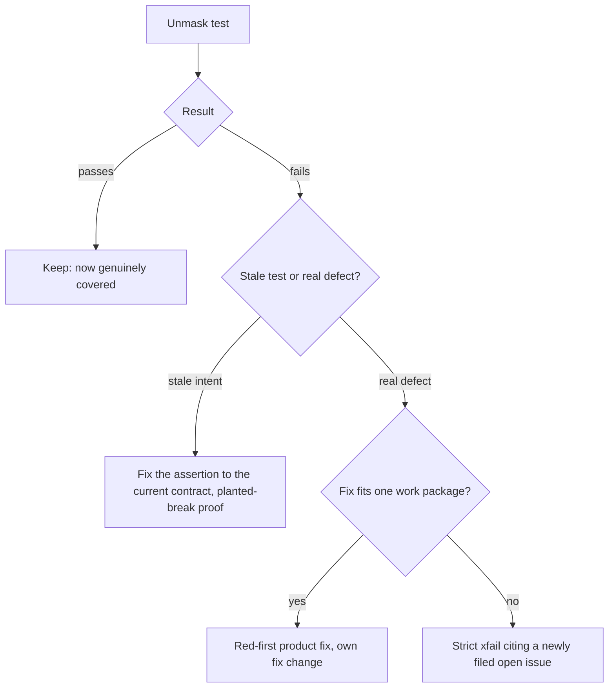

# Mission Specification: Test-suite remediation: masked greens, harness and pin honesty

**Mission Branch**: `issue-5353-test-suite-remediation`
**Created**: 2026-09-30
**Status**: Draft
**Input**: The 2026-09-30 test-suite slice-identification squad for #5353 (static triage, git-history forensics, friction signals), re-verified on `upstream/main` `74373ec95a`. The operator confirmed the scope: masked greens plus architectural pin honesty.

Parent: #5353 (test-suite quality). Addresses: #5346 (exact-count and copied-literal pins are re-pinned instead of converted).

The Mission title names three tracks, but the operator narrowed the scope to two: masked greens and pin honesty. Integration-harness honesty is out of scope (see C-004).

## Why this mission exists

A green run should mean that the tests ran and the contracts they guard hold. Two findings show that it does not today:

1. **Masked greens.** Some tests report success without executing their assertions:
   - A probe looks for shipped doctrine at a path that no longer exists, so nine tests skip on every run.
   - Other skips and xfails cite issues that have since closed, so their stated reason no longer holds.
   - Five quarantined tests run in no CI lane at all.
   - Some tests turn a build or metadata error into a skip.
2. **Pins that punish correct changes.** The architectural gates are the hottest area of the suite on every history metric: 822 commits, 141 of them repairs, co-changing with 821 source files. The cause is exemption data held in the test source: exact counts of live collections, and allowlists keyed by function-body hashes. A behaviour-neutral change to production code forces a test edit, and the landing pass pays that repeatedly (308 of 571 test-repair commits are landing re-pins). Line-number anchors were already fixed by #5085; counts and hashes are the same problem one level up.

## User Scenarios & Testing *(mandatory)*

### User Story 1: A green run means the masked tests actually ran (Priority: P1)

A maintainer runs the suite and sees it pass. Every test that reports a pass executed its assertions, so none of them is silently skipped because of a moved path, a closed issue or a swallowed error.

**Why this priority**: A masked green is a false statement about product health. It can hide a live defect, which is the most expensive kind of test debt.

**Independent Test**: Run the affected test files in a standard repository checkout. The nine formerly always-skipping tests execute, and each remaining skip or xfail in the remediated inventory names a still-valid reason. A skip of that kind is either a platform or tool guard, or it cites an issue that is still open.

**Acceptance Scenarios**:

1. **Given** the shipped doctrine is present in the checkout, **When** the doctrine pack-validator and quickstart tests run, **Then** all nine tests that probe for it execute rather than skip.
2. **Given** a skip or xfail whose cited issue is closed, **When** the mission is complete, **Then** that test either runs, or cites an open issue whose reason still holds, or has been retired with a named covering guard.
3. **Given** a test that previously turned a build or metadata error into a skip, **When** that error occurs, **Then** the test fails and names the error, unless the condition is a declared platform or tool guard.
4. **Given** the quarantined accept tests, **When** CI runs, **Then** at least one lane executes them.

---

### User Story 2: A behaviour-neutral change needs no test edit (Priority: P1)

A contributor changes the body of a function that the dead-symbol allowlist exempts, or adds an entry to a collection that a gate currently counts exactly, without changing any contract. The architectural gates stay green without anyone touching the test source.

**Why this priority**: This is the dominant source of test friction in the suite. It taxes every landing and trains contributors to re-pin rather than think.

**Independent Test**: Plant a behaviour-neutral change: edit the body of an allowlisted dead symbol, or make a legitimate addition to a counted collection. Run the converted gates; they stay green with no test-file edit. Then plant a real violation: a newly dead symbol, a duplicate or stale entry, or a count below its floor. The same gates go red.

**Acceptance Scenarios**:

1. **Given** an allowlisted dead symbol, **When** its body changes and its name and location do not, **Then** the dead-symbol gate stays green without an allowlist edit.
2. **Given** a symbol that newly becomes dead, **When** the dead-symbol gate runs, **Then** it goes red and names the symbol.
3. **Given** an allowlist entry whose symbol has been deleted or is used again, **When** the dead-symbol gate runs, **Then** it reports the entry as stale.
4. **Given** a converted exact-count pin, **When** a legitimate entry is added to the counted collection, **Then** the gate stays green. **When** an entry is duplicated, or the collection drops below its floor, **Then** the gate goes red.

---

### User Story 3: An unmasked test that catches a real defect stays honestly red (Priority: P2)

Unmasking a test shows that it catches a live product defect rather than being stale. The defect is either fixed or visibly tracked; it is never re-masked.

**Why this priority**: DIRECTIVE_041 and the red-main discipline forbid silencing a valid red. The mission must have a defined path for the reds it uncovers.

**Independent Test**: Take an unmasked test that goes red. Its outcome is recorded as one of two things: a red-first product fix that turns it green, or a strict xfail citing a newly filed open issue that describes the defect.

**Acceptance Scenarios**:

1. **Given** an unmasked test catches a defect whose fix fits within one work package, **When** the mission delivers, **Then** the product is fixed red-first, in its own fix change, and the test passes.
2. **Given** an unmasked test catches a defect too large for one work package, **When** the mission delivers, **Then** the test is a strict xfail whose reason cites a newly filed, open issue, and the xfail still fails for that reason.

### Remediation flow for an unmasked test

### Edge Cases

- A skip cites a closed issue, but its guard is a genuine platform or tool guard, e.g. symlinks on Windows or a missing external binary. The guard stays; only the stale citation is corrected.
- A strict xfail cites a closed issue but still fails for its stated reason. It is re-pointed to an open issue that describes the residual, not removed.
- A quarantined test that passes alone fails only under parallel execution. Its parallel-unsafety is fixed, or it runs in a serial lane. It must not remain in a quarantine that nothing executes.
- A counted collection legitimately shrinks, e.g. debt removed. The floor or baseline tightens as a deliberate ratchet step, which is expected and not friction.
- A dead-symbol allowlist entry names a symbol that is renamed or moved. That is not a behaviour-neutral body edit, so the entry must be updated, and the gate reports it as stale rather than passing silently.
- A pin listed in #5346 no longer exists or was already converted by an earlier slice. It is recorded as resolved, with the commit or test that resolved it.

## Domain Language

| Term | Meaning | Avoid |
|---|---|---|
| **Masked green** | A test that reports pass or skip without executing the assertion that guards its contract. | "flaky" (different failure class) |
| **Pin** | An assertion or allowlist key that fixes an incidental value of live structure: an exact count, a copied literal or a function-body hash. | "baseline" when the value is not a debt ledger |
| **Ratchet baseline** | A frozen record of known debt that may only shrink, or tighten a floor, as debt changes. | "pin" |
| **Invariant form** | The stable replacement for a pin: a floor, a duplicate check, a stale-entry check, an absence scan or a behavioural assertion. | |
| **Covering guard** | The named test that still asserts a retired test's contract and goes red on the same planted break. | |
| **Planted break** | A deliberate one-line product mutation, used to prove that a test can go red. It is always reverted and never committed. | |
| **Honest red** | A failing test left visible, as a strict xfail citing an open issue, instead of being silenced. | |

## Requirements *(mandatory)*

### Functional Requirements

| ID | Title | User Story | Priority | Status | Delivery | No-op passable? |
|----|-------|------------|----------|--------|----------|-----------------|
| FR-001 | Shipped-doctrine probe finds the doctrine | As a maintainer, I want the nine tests that probe for shipped doctrine to execute in a standard checkout, so that their collision and enhancement contracts are really guarded. Five are in the pack-validator intent-collision group and four in the quickstart end-to-end steps. | High | Open | [build] | no: the executed-versus-skipped count for those nine tests is observed before and after |
| FR-002 | No skip or xfail rests on a closed issue | As a maintainer, I want every skip or xfail in the remediated inventory that cites a closed issue to either run, be re-pointed to an open issue whose reason still holds, or be retired with a named covering guard. The inventory: the two egress-scanner xfails citing #3113; the accept-diagnose quarantine citing the closed EXPERIMENTAL issue 171; the dead guards citing #932 and #828; the retired-sync gate module (see #3213). | High | Open | [build] | no: each inventory item's final disposition is recorded and checked |
| FR-003 | Quarantined tests run somewhere | As a maintainer, I want the five quarantined accept-diagnose tests executed by at least one CI lane, or made safe to run in the normal parallel lane, so that they are not coverage that nothing runs. | High | Open | [build] | no: lane collection of the five tests is verified |
| FR-004 | Errors fail instead of skipping | As a maintainer, I want tests and fixtures that currently turn a build, packaging-metadata or time-budget error into a skip to fail with the error instead. Declared platform or tool guards are the only exception. | Medium | Open | [build] | no: a planted build or metadata failure makes the test fail rather than skip |
| FR-005 | Real defects found by unmasking are fixed or honestly red | As a maintainer, I want every unmasked test that catches a real product defect either fixed red-first, if the fix fits one work package, or kept as a strict xfail citing a newly filed open issue, so that no uncovered defect is re-masked. | High | Open | [build] | no: each unmasked red has a recorded outcome, a fix change or a new open issue |
| FR-006 | #5346 pins converted | As a contributor, I want each pin listed in #5346 converted to an invariant form, or deleted with its surviving coverage named, so that the listed re-pin hotspots stop recurring. Examples: the top-level-keys count, the compat-surface symbol count and the hand-built allocator path. | High | Open | [build] | no: each listed pin has a recorded disposition and a planted-break proof |
| FR-007 | Recurring exact-count class converted | As a contributor, I want the exact-count pins over live collections that have been re-pinned since August converted to invariant forms (floor plus duplicate and stale checks, or behavioural assertions). The plan fixes the inventory (research/pin-inventory.md and the research.md count note: live-structure pins F1–F12 over 13 files, e.g. the materialize-call count, the bulk-edit counts, the glossary anchor count and the mission-review diagnostic count). Ratchet baselines that moved only with real debt, such as the destructive-op baseline and the inert-slot ceiling, are kept per FR-008 and C-003, with a recorded disposition. The routed-load floor was already deleted upstream. Then a legitimate addition no longer forces a test edit. | High | Open | [build] | no: a planted legitimate addition leaves the gate green; a planted duplicate or floor breach turns it red |
| FR-008 | Ratchets move only with debt | As a contributor, I want every ratchet baseline touched by this mission to change only when the debt it tracks changes, so that a behaviour-neutral production change never requires a baseline edit. | High | Open | [ratchet] | yes: paired with FR-007 and FR-009's planted-violation controls on the same fixtures |
| FR-009 | Dead-symbol allowlist tolerates body edits | As a contributor, I want the dead-symbol allowlist identified by stable content rather than function-body hashes, so that a body edit to an allowlisted symbol needs no allowlist edit. A newly dead symbol must still fail the gate, and a deleted or revived allowlisted symbol must still be reported as stale. | High | Open | [build] | no: a planted body edit stays green; a planted newly dead symbol and a planted stale entry go red |
| FR-010 | Shift-left census gate against new exact-count pins | Withdrawn at plan time (decision DM-01M3SVDP). ADR 2026-09-14-1 retired the golden-count ban after it made 0 catches in its lifetime, forced 13 re-freezes and left 387 annotation tolls; regrowth of exact-count pins stays a review concern. No gate is added. | Low | Withdrawn | [folded] | n/a: withdrawn; FR-006/FR-007 remove the existing pins |
| FR-011 | Every change carries its proof | As a reviewer, I want every FIX recorded with a planted break (the old test green, the new test red), and every RETIRE with a named covering guard that goes red on the same break, so that no coverage is lost unseen. | High | Open | [build] | no: the evidence record is checked item by item at review |

### Non-Functional Requirements

| ID | Title | Requirement | Category | Priority | Status |
|----|-------|-------------|----------|----------|--------|
| NFR-001 | No coverage loss | Across the remediated masked-green files (FR-001..FR-004) taken together, the number of tests that execute (pass, fail or xfail, but not skip) is greater than or equal to the count before the mission, plus the nine formerly masked tests. No individual masked-green file executes fewer tests than before. Pin-honesty retirements are governed by C-002 and FR-011, with a covering guard proven red (plan ruling RK-1). | Reliability | High | Open |
| NFR-002 | Census gate is fast | Withdrawn with FR-010 (decision DM-01M3SVDP): no census gate is added. | Performance | Low | Withdrawn |
| NFR-003 | Neutral change costs zero test edits | For each converted gate, a planted behaviour-neutral change requires 0 edits to test source or baselines to stay green. That change is a body edit to an allowlisted symbol, or a legitimate addition to a counted collection. | Maintainability | High | Open |
| NFR-004 | Skip hygiene in touched files | 100% of the skip or xfail markers in files the mission touches carry a reason. Every such marker that refers to a defect cites an issue that is open at mission close. | Reliability | High | Open |
| NFR-005 | Code-quality gates | Touched files add 0 new lint, format or type findings, and no function exceeds cyclomatic complexity 15. | Maintainability | High | Open |

### Constraints

| ID | Title | Constraint | Category | Priority | Status |
|----|-------|------------|----------|----------|--------|
| C-001 | Named-file test runs only | Verification runs named test files and named gate files only. No directory sweep of `tests/architectural/`, no end-to-end, performance or stress suite, and no full-suite run (NO_FULL_HEAVY_SUITES_IN_MISSION). | Technical | High | Open |
| C-002 | No retirement without a proven guard | A test is deleted only after its named covering guard goes red on the same planted break. If the guard stays green, the verdict changes to KEEP or FIX. | Technical | High | Open |
| C-003 | Ratchets stay shrink-only | No allowlist or baseline is loosened to reach green, and no new suppression (lint ignore, type ignore or skip) is added to pass a gate. | Technical | High | Open |
| C-004 | Scope boundary | Out of scope: the integration-harness honesty track (the fake-git merge harness and nightly integration reds; #5417 is in flight and is re-checked after the next nightly); slice-level quality passes of the `status`, `agent`, `tracker` and `auth` slices; and curating the stale known-reds list in the project guidelines. Individual pins inventoried under FR-006/FR-007 stay in scope wherever their files live, including under those directories (analysis finding F2). | Business | High | Open |
| C-005 | Product fixes are defect-driven | Product source changes only to fix a defect that an unmasked test surfaced (FR-005), or where a gate conversion needs a small supporting seam. Each product fix is red-first and in its own change. | Technical | High | Open |
| C-006 | Archived artefacts are immutable | Mission artefacts under `kitty-specs/` from earlier missions are not edited. Stale guidance is corrected at its live source instead. | Technical | Medium | Open |
| C-007 | Planted breaks never land | No planted break appears in any committed change. Every commit's product-source diff contains only the intended fixes. | Technical | High | Open |
| C-008 | No new exact-count census gate | This mission adds no gate that bans or ratchets exact-count assertions, honouring ADR 2026-09-14-1 (decision DM-01M3SVDP). Converted pins are guarded by their own invariant-form tests. | Technical | High | Open |

### Key Entities

- **Masked-green inventory**: the named set of tests and markers that FR-001 to FR-004 remediate. Each item has a final disposition: runs, re-pointed, retired with a guard, or honest red.
- **Pin inventory**: the exact-count, copied-literal and content-hash pins that FR-006 to FR-009 convert. Each has a disposition and a planted-break record.
- **Evidence record**: per item, the planted break, the before and after results, and the covering guard for a retirement (FR-011).

## Success Criteria *(mandatory)*

### Measurable Outcomes

- **SC-001**: The number of tests that skip because they probe for a path that no longer exists drops from 9 to 0. — [build] · no-op passable: no
- **SC-002**: The number of skip or xfail markers whose only stated reason cites a closed issue drops to 0 across the remediated inventory. — [build] · no-op passable: no
- **SC-003**: A behaviour-neutral body edit to an allowlisted dead symbol requires 0 test-source edits; today it requires at least 1. — [build] · no-op passable: no
- **SC-004**: Every pin listed in #5346 and every exact-count pin in the recurring class has a recorded disposition; 100% are converted, deleted with a guard, or recorded as a genuine contract cardinality kept with its reason. — [build] · no-op passable: no
- **SC-005**: 100% of FIX and RETIRE changes have a planted-break record, and the independent review re-runs at least 6 FIX breaks and 2 RETIRE guards itself. — [build] · no-op passable: no
- **SC-006**: Withdrawn with FR-010 (decision DM-01M3SVDP, ADR 2026-09-14-1). No census gate is measured. — [folded] · no-op passable: n/a

## Assumptions

- The five quarantined accept-diagnose tests fail only under parallel execution (the recorded reason is "fails under xdist, passes alone"). The mission makes them run, either by fixing the parallel-unsafety or through a serial lane; it does not delete them.
- The nine doctrine-probe tests are expected to pass once they execute. Any that fail follow FR-005.
- "The recurring exact-count class" means the exact-count pins re-pinned at least once since August 2026, as recorded in the friction lens report. The plan step fixes the exact inventory, and anything not converted is recorded as a genuine contract cardinality, with its reason.
- The `tests/consolidation` slice (PR #5407) may already have resolved some #5346 items. Those are recorded as resolved, not reworked.

## Dependencies and References

- Parent: #5353. Addresses: #5346.
- Builds on the line-anchor fix #5085 (a merged PR) and the slice-review pattern of PR #5407, PR #5416 and the `tests/cli` slice.
- Evidence: `work/test-quality/2026-09-30/triage/` (`synthesis.md`, `lens-static.md`, `lens-caacs.md`, `lens-friction.md`). This is gitignored local analysis; the plan restates the facts it relies on.
- Doctrine: DIRECTIVE_041, tactic `acceptance-criteria-non-vacuity`, tactic `architectural-gate-non-vacuity`, tactic `frozen-baseline-shrink-only-ratchet`, and the `test-desiderata-and-boundaries` styleguide.
