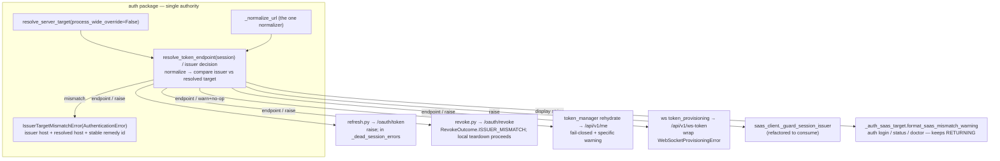

# Implementation Plan: Auth token-target issuer guard

**Branch**: `issue-4755-token-target-issuer-guard` | **Date**: 2026-09-21 | **Spec**: [spec.md](./spec.md)
**Input**: Feature specification from `kitty-specs/token-target-issuer-guard-01M319HS/spec.md`

## Summary

Route every token-bearing auth call to the host the session was issued against, refuse on
issuer/target mismatch, and fence the unsafe accessor so the defect class cannot recur — closing the
#4755 credential-exposure gap **structurally** (one canonical authority + arch gate) rather than as a
four-site patch. A single decision helper `resolve_token_endpoint(session)` lives in the `auth`
package and is consumed by the four token-send flows and the two pre-existing guards; each consumer
keeps its own reaction (raise / display-string / warn-and-no-op). The unsafe `get_saas_base_url()` is
forbidden on token-send paths by a non-vacuous architectural gate. Two same-seam P3 findings (#4053,
#4265) fold in as campsite work on files the unification already rewrites.

## Technical Context

**Language/Version**: Python 3.11+ (repo baseline; `from __future__ import annotations` in-module)
**Primary Dependencies**: stdlib + existing auth stack — `httpx` (async/sync clients), `toml`
(config read, already used by `server_target`), `kernel.clock`; no new third-party dependency.
**Storage**: N/A — the encrypted session store (`StoredSession`) already carries `issuer_url`; no
schema change, no migration.
**Testing**: `pytest` (unit + architectural); network-free via fake loopback / monkeypatched
resolvers and clients, per the existing auth test patterns (`tests/auth/`, `tests/architectural/`).
**Target Platform**: Linux/macOS/Windows CLI (POSIX + Windows lock paths already handled upstream).
**Project Type**: single project (CLI library under `src/specify_cli/`).
**Performance Goals**: no measurable change — the helper adds one in-process resolution + one
normalized string compare per token-bearing call; no extra network round-trip.
**Constraints**: `ruff` + `mypy` zero warnings, cyclomatic complexity ≤ 15, no new blanket
suppressions (NFR-007); security equality + request URL funnel through ONE normalizer (NFR-002);
refusal diagnostics token-free (NFR-006); no behavioural change for issuer==target sessions (NFR-005).
**Scale/Scope**: ~4 flow edits + 1 new helper + 1 new error type + 2 guard unifications + 1 arch gate
+ 2 campsite folds; net a contained, security-critical change in the `auth` bounded context.

**Supply-chain note**: no dependency is added, upgraded, or removed. The supply-chain planning gate is
therefore not engaged (documented here so the omission is explicit, not silent).

## Constitution Check

*GATE: Must pass before Phase 0 research. Re-check after Phase 1 design.*

| Charter principle | How this plan complies |
|---|---|
| **Single canonical authority** (Gov. Principle 1, DIRECTIVE_044) | ONE `resolve_token_endpoint` decision authority; the two pre-existing guards are refactored to CONSUME it (unification, not a 3rd/4th parallel copy); all normalizers collapse onto `server_target._normalize_url`. |
| **Architectural alignment** (DIRECTIVE_001) | Helper homed in the `auth` package beside `resolve_server_target`; `saas_client` consuming it is the existing, layer-legal pattern (both under `specify_cli`; no LayerRule crosses). No new top-level module. |
| **DDD + tiered rigour** | `auth` is security-critical core domain → high rigour: focused, deterministic, network-free unit tests on the helper and each per-flow adapter, executing every new branch. |
| **ATDD-first / red-first** (DIRECTIVE_041, ADR 2026-07-17-1) | Each live consequence lands an issue-pinned `@pytest.mark.regression` repro RED through the pre-existing entry point before the fix; ws (dormant) verified by direct invocation. Transitional repros become focused unit tests after the fix. |
| **Architectural gate discipline** (DIRECTIVE_043) | The `get_saas_base_url()` fence is non-vacuous: concrete allowlist floor + self-mutation test (fails when a token module regains the call) + second assertion (fails when a token-send module is added to the allowlist). |
| **Campsite / smallest-viable-diff reconciliation** (DIRECTIVE_024/025, RECONCILE_CHANGE_SCOPE_TENSIONS) | Fold #4053/#4265 only on lines the unification already rewrites; no net-new files chasing them. |
| **Terminology canon** | No `feature`/`sync`-transport vocabulary introduced; "moment"/Zeitgeist unaffected (this is auth target selection, not the status transport). |

**Result**: PASS (no violations → Complexity Tracking empty).

## Architecture

### Shared decision, per-consumer reaction



The **decision** (normalize → compare → verdict carrying issuer host / resolved host / remedy id) is
computed in one place. `resolve_token_endpoint(session)` is the raise-based convenience wrapper the
four flows + `saas_client` use; the display consumers call the same decision but render its verdict as
a string. This preserves the display-vs-raise duality (FR-007, M1).

### Guard-at-the-send placement

- **refresh**: resolve+guard at the **TokenManager boundary** (before entering `run_refresh_transaction`
  / the machine lock), so `ServerTargetSplitBrainError` / `IssuerTargetMismatchError` never enter the
  in-lock refresh flow's error contract (design D-3). `IssuerTargetMismatchError` is added to
  `_dead_session_errors()` so the `saas_client._usable_access_token` held-token fast path treats it as
  a hard refusal, never demoting it to "use the held token" (FR-008, M4).
- **revoke**: guard **before** the `try` so `except Exception` cannot fold the refusal into
  `SERVER_FAILURE`; return new `RevokeOutcome.ISSUER_MISMATCH`; `_auth_logout` still tears down the
  local session and warns that server revocation did not occur (US2 AC5, M3).
- **rehydrate**: thread `session` into `_resolve_saas_base_url` (no session param today) / resolve at
  the call site; a mismatch raise is caught by the existing `except Exception → return False` — kept as
  a fail-closed no-op, but the warning is made specific (names hosts + remedy, FR-009).
- **ws**: guard before building the URL and before `get_access_token`; wrap the mismatch into
  `WebSocketProvisioningError` carrying the remedy.

## Project Structure

### Documentation (this mission)

```
kitty-specs/token-target-issuer-guard-01M319HS/
├── plan.md              # This file
├── research.md          # Phase 0 output
├── data-model.md        # Phase 1 output
├── quickstart.md        # Phase 1 output
├── contracts/           # Phase 1 output (issuer-target-helper.md)
└── tasks.md             # Phase 2 output (/spec-kitty.tasks — NOT created here)
```

### Source Code (repository root)

```
src/specify_cli/auth/
├── server_target.py           # + resolve_token_endpoint(session) + issuer decision; canonical _normalize_url
├── errors.py                  # + IssuerTargetMismatchError(AuthenticationError)
├── config.py                  # get_saas_base_url() def (fenced target, not edited except docstring)
├── flows/refresh.py           # consume endpoint; guard moved to TokenManager boundary
├── flows/revoke.py            # + RevokeOutcome.ISSUER_MISMATCH; guard before try
├── token_manager.py           # thread session → _resolve_saas_base_url; add error to _dead_session_errors; refresh-boundary guard
├── http/me_fetch.py           # fix strip-less rstrip → canonical normalizer
└── websocket/token_provisioning.py  # consume endpoint; wrap mismatch

src/specify_cli/saas_client/
└── auth.py                    # _guard_session_issuer refactored to consume the shared decision

src/specify_cli/cli/commands/
├── _auth_saas_target.py       # format_saas_mismatch_warning consumes shared decision; fold #4053 (dead branch/import/label)
├── _auth_login.py             # fold #4265 (mismatch exit code + canonical-URL comparison)
└── _auth_logout.py            # honour RevokeOutcome.ISSUER_MISMATCH messaging

tests/
├── auth/                      # helper + per-flow adapter unit tests; RED-first repros (refresh/revoke/rehydrate)
├── saas_client/               # held-token-swallow non-demotion test; guard-consumes-shared test
├── cli/                       # auth logout teardown-on-mismatch; auth login exit code (#4265)
└── architectural/test_egress_consent_boundary.py  # extend E18 → non-vacuous get_saas_base_url fence (both directions)
```

**Structure Decision**: single project; all edits inside the `auth` bounded context plus its two
existing consumers (`saas_client`, `cli/commands`) and the architectural test suite. No new module,
no new package, no dependency.

## Complexity Tracking

*Constitution Check passed with no violations — no entries.*

## Parallel Work Analysis

### Dependency Graph

> **Note (write-scope collapse):** the initial sketch below separated refresh (WP02) and rehydrate
> (WP04). Because BOTH live in `token_manager.py` — a file that must be single-owner — the `/spec-kitty.tasks`
> step correctly merged them into one WP that owns `token_manager.py` entirely. The finalized breakdown is
> therefore **5 WPs** (`tasks.md`), not 6. The 5-WP graph is authoritative:

```
WP01 Foundation (helper + error + canonical normalizer)      [must land first]
        │
        ├── WP02 Refresh + rehydrate + held-token non-demotion (refresh.py, token_manager.py, me_fetch.py, saas_client/auth.py)
        ├── WP03 Revoke + logout teardown (revoke.py, _auth_logout.py)
        └── WP04 WS provisioning (token_provisioning.py)      [WP02–WP04 parallel after WP01]
        │
WP05 Non-vacuous arch fence (both directions) + display unification + campsite folds #4053/#4265
        [after WP01–WP04 — the fence is green only once all four flows are rewired]
```

### Work Distribution

- **Sequential first**: WP01 establishes the shared decision + error + canonical normalizer. Everything
  else depends on it.
- **Parallel streams**: WP02–WP04 each own disjoint files (write-scope isolation is the real guard).
  WP05 (fence + display unification + folds) lands last, once all four flows are off `get_saas_base_url()`.
- **Ownership**: WP02 owns `token_manager.py` in full (refresh boundary + rehydrate), `refresh.py`,
  `me_fetch.py`, and `saas_client/auth.py` (held-token non-demotion + guard unification); WP03 owns
  `revoke.py` + `_auth_logout.py`; WP04 owns `token_provisioning.py`; WP05 owns the arch test +
  `_auth_saas_target.py` + `_auth_login.py` + `config.py`. Collapsing refresh+rehydrate into WP02 removes
  the `token_manager.py` write-overlap the original sketch would have created.

### Coordination Points

- After WP01, re-confirm the helper signature is frozen before the parallel wave starts.
- Integration check: a cross-flow test asserting all four flows + both guards resolve through the one
  helper (positive-membership, SC-003) runs after the wave.

## Phase 0 / Phase 1 outputs

- `research.md` — consolidates the grounding-squad findings (design decisions D-1..D-6, the swallow-path
  trap, dormant ws, in-lock boundary) as the resolved research record; no open clarifications.
- `data-model.md` — the (unchanged) `StoredSession.issuer_url` field, the `ResolvedServerTarget`, and
  the new `IssuerTargetMismatchError` verdict shape.
- `contracts/issuer-target-helper.md` — the helper signature, the decision contract, per-consumer
  reaction table, and the arch-fence allowlist contract.
