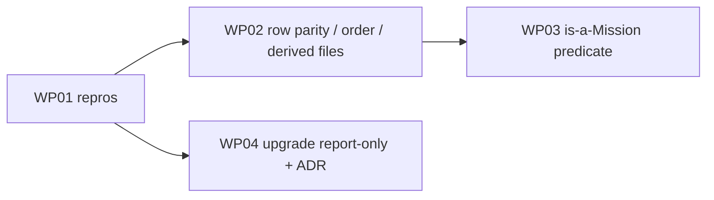

# Implementation Plan: Upgrade must not rewrite healthy Mission history

**Branch**: `issue-5811-upgrade-preserves-mission-history` | **Date**: 2026-10-07 | **Spec**: [spec.md](spec.md)
**Input**: Mission specification from `kitty-specs/upgrade-preserves-mission-history-01M49D3A/spec.md`

## Summary

`spec-kitty upgrade --yes` treats `--yes` as consent to the Team Kitty mission-state repair, and that repair runs across every directory under `kitty-specs/`. It rebuilds each lane row through a hand-written allowlist that emits null keys the live writer omits, re-sorts the rows, and re-materializes snapshots. This plan:

- makes `upgrade` report-only and gates it on drain;
- makes the repair round-trip lane rows through `StatusEvent` and the writer's own row-to-line function, keeping physical order;
- writes derived files only when the log changed and the file is tracked;
- adds one shared is-a-Mission predicate so residue directories are not Missions (#5812).

## Technical Context

**Language/Version**: Python 3.11+
**Primary Dependencies**: typer, rich, ruamel.yaml (existing); no dependency added, upgraded or removed
**Storage**: files: `kitty-specs/<mission>/status.events.jsonl` (authoritative, append-only), `status.json` and `lanes.json` (derived), `.kittify/mission-state-audit/*.json` (repair manifest)
**Testing**: pytest; CLI-level `p0_repro` tests (ADR `2026-07-17-1`) through `typer.testing.CliRunner`/subprocess on scratch git repositories; focused unit tests per helper
**Target Platform**: Linux, macOS, Windows CLI
**Project Type**: single
**Performance Goals**: no regression; the repair does strictly less work (no sort, fewer writes)
**Constraints**: complexity ≤15 per function; ruff, ruff format and mypy clean; `hosted_posture.drain_posture()` called through the module attribute (autouse test patch); layer rules unchanged (`core` is allowed from CLI commands)
**Scale/Scope**: about 650 Missions in the dogfooding repository; about 6 source files touched

**Supply chain**: no dependency decision, so `DIRECTIVE_051` controls do not apply.

## Charter Check

| Charter rule | How the plan honours it |
|---|---|
| Single canonical authority | The repair stops carrying its own row serializer and uses `StatusEvent.to_dict()` plus the store's row-to-line function. The is-a-Mission rule gets one public predicate. Drain is checked in one place. |
| ATDD / red-first (SO #4, ADR `2026-07-17-1`) | WP01 lands CLI repros, red on base, before any fix. |
| Architectural gate discipline (SO #5) | The sole-caller pin for `repair_repo` starts empty (the only caller is doctor) and has a self-mutation check; no allowlist. |
| Campsite cleaning (SO #2) | `_repair_mission` and `_canonicalize_status_rows` are near the complexity ceiling; the WP02 refactor extracts helpers first. |
| Terminology canon | Mission throughout; no new "feature" identifiers. |
| No full heavy suites | Targeted tests plus named gates only. |
| Git discipline | Topic branch, draft PR, operator merges. |

No violations.

## Project Structure

### Documentation (this mission)

```
kitty-specs/upgrade-preserves-mission-history-01M49D3A/
├── spec.md
├── plan.md
├── research.md
├── data-model.md
├── quickstart.md
├── checklists/requirements.md
└── tasks/
```

No `contracts/` directory: the Mission adds no API or schema surface (`meta.json` records `contracts: none`).

### Source Code (repository root)

```
src/specify_cli/
├── cli/commands/upgrade.py                       # WP04: stop passing repair consent
├── cli/commands/_teamspace_mission_state_gate.py # WP04: drain gate, report-only
├── cli/commands/_mission_state_doctor.py         # unchanged caller (sole repair caller)
├── context/mission_resolver.py                   # WP03: public is_mission_dir predicate
├── audit/engine.py                               # WP03: use the predicate
├── migration/mission_state.py                    # WP02 (rows/order/derived files), WP03 (selection)
└── status/store.py                               # WP02: public row-to-line function
docs/adr/4.x/2026-10-07-1-upgrade-never-runs-mission-state-repair.md  # WP04
tests/
├── integration/migration/test_noop_upgrade_history_untouched_5811.py  # WP01 (per-PR CI module)
├── integration/migration/test_residue_dir_not_mission_5812.py         # WP01
└── (focused unit tests beside each touched module)
```

## Complexity Tracking

None.

## Implementation Concern Map

### IC-01: Red-first reproductions
Covers FR-009 and NFR-001. Two `@pytest.mark.p0_repro(issue=N)` CLI tests:
- **#5811:** writer-shaped historical Missions plus one blocker, with drain on. Runs `upgrade --yes` and asserts the bytes of every file are unchanged, no audit manifest exists, and `git status --porcelain` is clean under `kitty-specs/`.
- **#5812:** a residue-only directory gets no blocker and no created files.

Both tests are red on base.

### IC-02: Lane-row parity and order preservation
Covers FR-003, FR-004, FR-005, FR-008 and NFR-003.
- Expose the store's row-to-line serialization (`sanitize_event_for_log` plus JSON encoding) as one public function.
- In `_canonicalize_status_rows`, lane rows run alias and strip, then `StatusEvent.from_dict(...).to_dict()`, then the store function. Non-lane and annotation rows pass through byte-preserved. Delete the `_build_canonical_row` allowlist.
- Remove the `_row_sort_key` sort.
- `_repair_mission` writes `status.json` and `lanes.json` only when the log changed and the file is tracked; other drift is reported.
- Parity test generated from `dataclasses.fields(StatusEvent)` over optional-field subsets.

### IC-03: Shared is-a-Mission predicate
Covers FR-006 and the #5812 slice of FR-008.
- `is_mission_dir(path, repo)`: true when `spec.md` or `meta.json` is git-tracked.
- `_select_mission_dirs` and the audit engine consume it; rejected directories are reported as non-blocking `RESIDUE_DIRECTORY` findings.
- Identity backfill still runs for real legacy Missions.

### IC-04: Upgrade becomes report-only
Covers FR-001, FR-002, FR-007, FR-010, FR-011 and C-003/C-004.
- The gate evaluates readiness only when `hosted_posture.drain_posture()` is enabled, and never calls `repair_repo`. It prints the blockers and `spec-kitty doctor mission-state --fix`.
- `upgrade.py` stops passing `repair_opt_in`.
- The repair outcome names errored Missions and exits non-zero (doctor path).
- New ADR.
- Sole-caller test for `repair_repo`.
- Retire or re-pin the upgrade-consent tests that assert `--yes` runs the repair.

## Sequencing



WP02 and WP03 share `mission_state.py` and run in sequence in one lane. WP04 runs in a parallel lane.
