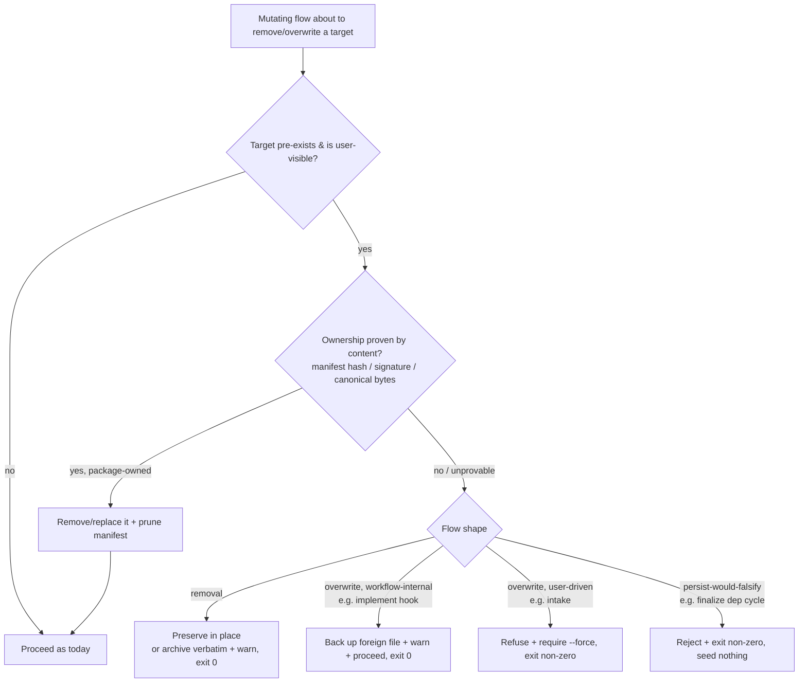

# Mission Specification: User-content preservation for mutating flows

**Mission Branch**: `fix/user-content-preservation`
**Created**: 2026-09-22
**Status**: Draft
**Input**: Epic #4915 — "User-data & customization preservation: mutating flows must never silently destroy user-authored files" (children #4907, #4895, #4910, #2691, #4896, #4890, #4888)

## Summary

Seven catfooding defects share one operator-betrayal shape: an ordinary Spec Kitty
command **mutates, deletes, or corrupts user-authored content, reports success
(exit 0), and never warns**. Several targets are gitignored or the loss is silent,
so the damage is often unrecoverable and undetected until much later. This mission
enforces the charter's *existing* **User Customization Preservation** invariant
(charter L463–479) across the remaining mutating flows, so Spec Kitty never fights
its own operator.

A prior mission (`ownership-boundary-preservation-01M32KEN`, issues #4859/#4861/#4862)
already shipped the canonical guard `asset_preservation.guard_destructive_removal`
+ pluggable ownership provers and a non-vacuous routing census gate
(`tests/architectural/test_mutation_ownership_routing.py`) — but wired it into
`init` and `upgrade/migrations/` **only**. The flows in this mission are exactly the
uncovered ones. This mission **extends the reach of that established guard** for the
removal flows and applies targeted, contract-consistent preservation to the
overwrite/corruption flows — it does not fork a second authority.

## User Scenarios & Testing *(mandatory)*

### User Story 1 - Removing or syncing an agent keeps my custom command files (Priority: P1)

An operator has hand-authored slash commands under `.claude/commands/` (in 4.x that
directory is *purely* user-owned and gitignored — Spec Kitty deploys to
`.claude/skills/`). They run `spec-kitty agent config remove claude` (or a routine
`spec-kitty agent config sync`, whose orphan sweep is on by default).

**Why this priority**: #4907 is a **P0** — permanent, unrecoverable destruction of
user content with a success message, from a routine config command. #2691 shares the
exact same `_remove_project_agent_surface` rmtree seam via the sync orphan sweep.

**Independent Test**: Create a user file inside a command-layer agent's managed
subdir that Spec Kitty did not deploy; run `remove` / `sync`; assert the file
survives (or is recoverably archived) and the command reports the preservation.

**Acceptance Scenarios**:

1. **Given** a user-authored `.claude/commands/my-deploy.md` with no manifest entry, **When** `spec-kitty agent config remove claude` runs, **Then** the file is preserved in place, the command exits 0, and its output warns that unproven content was preserved (verdict-driven) — matching the manifest/hash-proven skill-only branch that already does this.
2. **Given** the same state, **When** a bare `spec-kitty agent config sync` runs (the orphan sweep is default-on — `--remove-orphaned` defaults `True`; `--keep-orphaned` opts out), **Then** the user file is likewise preserved and reported; only manifest/hash-proven files are removed.
3. **Given** a genuinely package-deployed, manifest-proven command file, **When** `remove` runs, **Then** it *is* removed and its manifest entry pruned (preservation must not become preserve-everything).
4. **Given** a repository-pinned `.kittify/command-skills-manifest.json` with a recorded checksum, **When** a bare `spec-kitty agent config sync` runs, **Then** the pinned release/hash values are byte-identical afterwards and the `--json` output enumerates zero (unrequested) tracked mutations (#2691 manifest half).
5. **Given** a directory containing BOTH a manifest-proven file and an unproven user file (a mixed tree), **When** `remove`/`sync` runs, **Then** the whole directory is preserved (fail-closed, no partial rmtree) and no "Removed" is reported for it.
6. **Given** the same user file under any other command-layer agent's managed subdir (e.g. `.github/prompts/`, `.cursor/commands/`), **When** `remove`/`sync` runs, **Then** it is preserved too — the fix is `AGENT_DIRS`-table-driven, not `claude`-special-cased.
7. **Given** a genuinely package-owned surface, **When** `sync`'s orphan sweep removes it, **Then** it IS removed (owned-delete anchor exercised through the `sync` path, not just `remove`).

---

### User Story 2 - Running `implement` keeps my existing git pre-commit hook (Priority: P1)

A repository already has its own `.git/hooks/pre-commit` (secret scan, formatter,
lint-staged). The operator runs `spec-kitty implement WP##`, which installs the
ownership-guard hook.

**Why this priority**: #4895 is a **P0** — `implement` `os.replace()`s the hook with
no existence/signature check, silently disabling the operator's commit-time checks
for **every** `git commit` repo-wide (shared `.git/hooks`), untracked so
unrecoverable.

**Independent Test**: Install a foreign hook, run `implement`, assert the foreign
hook is backed up + the backup path is surfaced, and the operator's hook still runs
after (via the backup) — with a Spec-Kitty-signed hook still replaced normally.

**Acceptance Scenarios**:

1. **Given** a foreign (non-spec-kitty-signed) `.git/hooks/pre-commit`, **When** `spec-kitty implement WP##` installs the guard hook, **Then** the foreign hook is backed up to a timestamped sidecar, the backup path is named in the command output, and the operator can restore it (hybrid contract: back-up-and-warn, because refusing would break the in-progress implement loop).
2. **Given** an existing hook already bearing the spec-kitty signature (`# Generated by spec-kitty.`), **When** `implement` runs, **Then** it is replaced as today (no spurious backup churn) — signature is the ownership proof, mirroring `m_2_0_0_retire_git_hooks.py`.
3. **Given** no pre-existing hook, **When** `implement` runs, **Then** the guard hook installs unchanged from today's behaviour.

---

### User Story 3 - `intake` won't clobber my hand-written brief (Priority: P2)

An operator hand-authored `.kittify/mission-brief.md` (or its provenance sidecar was
never committed). They run `spec-kitty intake <plan.md>`.

**Why this priority**: #4910 (P1) — the overwrite gate keys on the *conjunction* of
brief **and** sidecar existence, so the most natural hand-authored shape (no sidecar)
is silently replaced, exit 0, no backup.

**Independent Test**: With a brief present and no sidecar, run `intake <doc>`; assert
it refuses without `--force` and leaves the brief byte-identical.

**Acceptance Scenarios**:

1. **Given** `.kittify/mission-brief.md` exists and `.kittify/brief-source.yaml` is absent, **When** `spec-kitty intake <doc>` runs without `--force`, **Then** it exits non-zero with the `Use --force to overwrite` message and the brief is byte-identical (hybrid contract: refuse+`--force`, because the operator drives the command and a flag is natural).
2. **Given** the same state, **When** `spec-kitty intake <doc> --force` runs, **Then** the brief is overwritten as intended.
3. **Given** the same brief-present/sidecar-absent state, **When** the `--auto` entry point runs (the second site sharing the `and` conjunction), **Then** it also refuses without `--force` and leaves the brief byte-identical — a fix must patch both entry points, not only the explicit one.

---

### User Story 4 - `validate-encoding --fix` repairs faithfully, never corrupts (Priority: P2)

The shipped `AGENTS.md` tells agents to run `spec-kitty validate-encoding --mission
<slug> --fix` to auto-repair encoding issues.

**Why this priority**: #4896 (P1) — a single stray byte triggers a whole-file cp1252
re-decode that mojibakes every multi-byte character, binaries named `*.md` are
rewritten, and CRLF is converted to LF file-wide — all reported `Fixed`, exit 0. An
agent that runs `--fix` and commits will commit the mojibake into spec artifacts.

**Independent Test**: Run `--fix` over a mixed-encoding `.md`, a binary named `.md`,
and a CRLF file; assert valid UTF-8 is untouched, binaries are skipped, line endings
preserved, and "Fixed" is printed only on a faithful repair.

**Acceptance Scenarios**:

1. **Given** a valid-UTF-8 `.md` with one stray non-UTF-8 byte, **When** `--fix` runs, **Then** every valid character is intact and only the stray byte is repaired (or the file is refused with the offending offset) — no whole-file transcode.
2. **Given** a binary file with a `.md` extension, **When** `--fix` runs, **Then** it is skipped (content sniff, not extension) and never rewritten.
3. **Given** a CRLF file with one smart quote, **When** `--fix` runs, **Then** CRLF line endings are preserved apart from the targeted substitution.
4. **Given** any file whose non-target bytes would change, **When** `--fix` runs, **Then** "Fixed" is NOT reported for it.

---

### User Story 5 - `finalize-tasks` never wedges my mission with a false-success dependency graph (Priority: P2)

The legacy `spec-kitty agent tasks finalize-tasks` runs cycle detection on the graph
parsed from `tasks.md` but persists whatever `dependencies:` the WP **frontmatter**
already carries, unvalidated.

**Why this priority**: #4890 (P1) — a WP01↔WP02 cycle (or a pointer to a non-existent
WP) living only in frontmatter passes every gate: exit 0, a falsified
`dependencies` payload, canonical status seeded, both WPs permanently unclaimable so
the mission can never reach accept/merge. The canonical `agent mission finalize-tasks`
correctly refuses the identical repository.

**Independent Test**: Author a frontmatter-only cycle; run legacy finalize; assert it
refuses (exit non-zero) with the same error class as the canonical command, seeds no
status, and its payload equals the persisted graph.

**Acceptance Scenarios**:

1. **Given** a WP01↔WP02 cycle declared only in frontmatter, **When** `agent tasks finalize-tasks` runs, **Then** it exits non-zero with a `Circular dependencies` error, does not seed canonical status, and does not report success.
2. **Given** a frontmatter dependency on an unknown `WP99`, **When** legacy finalize runs, **Then** it exits non-zero with an "unknown dependency" error (parity with `agent mission finalize-tasks`).
3. **Given** a WP with a frontmatter self-dependency (`WPnn → WPnn`), **When** legacy finalize runs, **Then** it exits non-zero via the `validate_dependencies` self-dependency branch (the third rejection class named in FR-009).
4. **Given** a valid acyclic frontmatter graph, **When** legacy finalize runs, **Then** it succeeds and its `dependencies` payload exactly equals the effective persisted graph.

---

### User Story 6 - Spec Kitty's auto-commits never wipe my staged work; if they can't restore it, they tell me where it went (Priority: P2)

`safe_commit` (behind every Spec Kitty auto-commit) preserves the operator's
unrelated staged changes with `git stash push --staged` … `git stash pop --index`.
That pop deterministically fails whenever any unrelated tracked file is *partially*
staged (a `git add -p` state).

**Why this priority**: #4890's sibling #4888 (P1) — a routine developer state makes
every auto-commit strip the operator's staged work into an un-poppable stash; and
`upgrade` swallows the typed signal: exit 0, "please commit manually" (nothing to
commit — the commit landed), the stash never named.

**Independent Test**: With an unrelated file partially staged plus another fully
staged, run each auto-commit caller; assert `git diff --cached` and `git stash list`
are byte-identical before/after; and where restoration genuinely fails, assert the
stash ref + landed SHA are surfaced and `upgrade` does not exit 0 with a misleading
message.

**Acceptance Scenarios**:

1. **Given** an unrelated file partially staged and another fully staged, **When** `spec-kitty safe-commit`, `agent mission create`, `agent mission finalize-tasks`, `agent action implement`, or `upgrade` runs, **Then** `git diff --cached` and `git stash list` are byte-identical before and after (the operator's index is never touched).
2. **Given** a genuine restoration failure, **When** any caller hits it, **Then** the stash ref and the landed commit SHA are surfaced; `upgrade` must not exit 0 with a message that hides the stash or misstates whether the commit landed. Additionally, `implement` must not report "Workspace allocation failed" while canonical status already shows the WP `in_progress`/committed.

**FR-011 ↔ FR-012 sequencing (resolves the review tension):** FR-011 is the *root* fix — `safe_commit` (already path-scoped) commits via a temporary index / path-scoped commit so the operator's index is never stashed, which makes the happy-path repro (AC1) green across all callers. FR-012 is *defense-in-depth* for the residual stash path (pre-FR-011 behaviour and any `--index` fallback): its regression (AC2) is exercised by forcing the stash-restore path (injection/fixture), not by the post-FR-011 temp-index flow, so it does not guard dead code. The `safe_commit` root fix must still commit exactly the passed `paths` — verify no caller relies on "commit whatever is staged" beyond `paths`.

---

### User Story 7 - The preservation invariant is enforced by construction (Priority: P3)

A future change adds a new destructive removal to an agent-config flow.

**Why this priority**: closes the defect class rather than one instance (charter
Standing Order #5 — architectural gate discipline). Lower story priority because it is
a by-construction backstop, not itself operator-visible, but required for durability.

**Independent Test**: Plant an un-routed destructive op in the newly-censused module;
assert the gate fails; drop a real allowlist entry; assert the exact gate failure
reproduces (self-mutation, both directions).

**Acceptance Scenarios**:

1. **Given** the routing census gate widened to cover `cli/commands/agent/config.py`, **When** its `_remove_project_agent_surface` removal is routed through the guard (literal-free), **Then** the gate passes; **When** a raw `rmtree`/`unlink` is re-introduced there, **Then** the gate fails by construction.
2. **Given** the shrink-only ratchet, **When** a censused site vanishes, **Then** the gate warns (not fails); **When** the routed-module set is narrowed to hide a module, **Then** the gate fails (completeness-checked).

### Edge Cases

- A command-surface directory containing **both** manifest-owned and user files: the guard fails closed (mixed tree ⇒ unprovable ⇒ preserve) — never a partial rmtree.
- A foreign pre-commit hook that is a symlink, or `.git/hooks` shared across worktrees: back up the target's bytes; never follow-and-clobber the link target silently.
- `intake` where the brief exists AND the sidecar exists (today's working refusal): unchanged — still refuses without `--force`.
- `validate-encoding` on a file that is genuinely cp1252 (not UTF-8): repair or refuse with offsets; do not assume UTF-8, but do not silently transcode either (cross-links #644, out of scope for redesign).
- `safe_commit` where the operator has nothing staged: unchanged happy path, no stash created.
- A second run of any fixed flow over an already-preserved/already-owned tree: idempotent, same verdict, no additional mutation.

## Requirements *(mandatory)*

### Functional Requirements

| ID | Title | User Story | Priority | Status |
|----|-------|------------|----------|--------|
| FR-001 | Route `agent config remove` command-surface deletion through the ownership guard (preserve unprovable content in place + warn, exit 0; remove only manifest/hash-proven files) — #4907 (P0) | US1 | High | Open |
| FR-002 | Route the `agent config sync` orphan sweep (`_remove_project_agent_surface`) through the same guard — same preserve semantics — #2691 (removal half) | US1 | High | Open |
| FR-003 | `agent config sync` must not rewrite repository-pinned compatibility manifests (`.kittify/command-skills-manifest.json`) during a normal sync: pinned release/hash values stay byte-identical, any manifest refresh is gated behind an explicit opt-in, and `--json` enumerates every intended tracked mutation before it occurs. Seam: the `command_installer.install` / `manifest_store` path (`_register_skill_agent`), separate from the rmtree seam — #2691 (manifest half) | US1 | Medium | Open |
| FR-004 | `implement` must detect a foreign `.git/hooks/pre-commit` by signature, back it up to a timestamped sidecar via a shared, symlink-aware `backup_before_overwrite` helper (`asset_preservation/backup.py`, built on `write_file_verbatim` — one backup-naming authority), install the guard hook, and surface the backup path in output; a spec-kitty-signed hook is replaced as today — #4895 (P0) | US2 | High | Open |
| FR-005 | `intake` overwrite gate must key on the brief's existence alone — at BOTH entry points, explicit/stdin and `--auto` — so a missing provenance sidecar ⇒ refuse without `--force`, exiting non-zero and leaving the brief byte-identical (a pure refuse gate; no backup taken) — #4910 | US3 | High | Open |
| FR-015 | Removal-flow messaging must be verdict-driven: a preserved (unprovable) surface must NOT report "Removed" — the command surfaces the preservation diagnostic and exits 0; routing must be dir-level (one guard call, whole-dir), never per-file, so a mixed manifest+user directory is preserved whole (no partial rmtree) — #4907/#2691 (FR-014 sharpening) | US1 | High | Open |
| FR-006 | `validate-encoding --fix` must not transcode content it did not identify as wrong — scope the fallback decode to the offending bytes or refuse with offsets — and must preserve existing line endings — #4896 | US4 | High | Open |
| FR-007 | `validate-encoding --fix` must classify text vs binary by content sniff, not `.md` extension, and never rewrite a binary — #4896 | US4 | High | Open |
| FR-008 | `validate-encoding --fix` must report "Fixed" only when the result is a faithful repair (no non-target byte changed) — #4896 | US4 | Medium | Open |
| FR-009 | Legacy `agent tasks finalize-tasks` must validate the *effective persisted* dependency graph (post frontmatter-preservation) with both cycle detection and `validate_dependencies`, rejecting cycles/self-refs/unknown-WP refs exactly as `agent mission finalize-tasks` — #4890 | US5 | High | Open |
| FR-010 | On rejection, legacy finalize must exit non-zero and seed no canonical status; on success its `dependencies` payload must equal the persisted graph — #4890 | US5 | High | Open |
| FR-011 | `safe_commit` must never mutate the operator's index/working tree for paths it was not asked to commit (commit via a temporary index / path-scoped commit) — #4888 | US6 | High | Open |
| FR-012 | When index restoration genuinely fails, every caller must surface the stash ref + landed commit SHA; `upgrade` must propagate `SafeCommitRecoveryFailed` instead of exiting 0 with a misleading skip warning — #4888 | US6 | High | Open |
| FR-013 | Widen the mutation-ownership routing census gate to include `cli/commands/agent/config.py`, preserving shrink-only + self-mutation + completeness invariants — closes the removal defect class by construction | US7 | Medium | Open |
| FR-014 | No mutating flow in scope may report success (exit 0 with a success message) while destroying, losing, or corrupting user-authored content — the umbrella invariant of epic #4915 | US1–US6 | High | Open |

### Non-Functional Requirements

| ID | Title | Requirement | Category | Priority | Status |
|----|-------|-------------|----------|----------|--------|
| NFR-001 | Recoverability | For every fixed flow, a user-authored/foreign artifact present before the command is either byte-identical after OR recoverable from a backup/preserved location named in the command output — verified for 100% of the seven issues' documented reproductions | Reliability | High | Open |
| NFR-002 | No happy-path regression | Genuinely package-owned cleanup still occurs (owned-delete anchors stay green); the guard/preserve checks add < 250 ms to `remove`/`sync` over a command surface of ≤ 200 files vs the pre-fix baseline on the test fixture, and no fixed command exceeds the charter's < 2s CLI budget for a typical project | Compatibility | High | Open |
| NFR-003 | Diagnostic completeness | Every preservation, backup, or refusal emits a single clear diagnostic naming the path, the reason, and the backup location where applicable | Observability | Medium | Open |
| NFR-004 | Red-first proof | Each defect ships a `@pytest.mark.regression` reproduction that is RED on the mission base through the pre-existing entry point and GREEN on the fix; each WP declares its targeted test surface | Testability | High | Open |

### Constraints

| ID | Title | Constraint | Category | Priority | Status |
|----|-------|------------|----------|----------|--------|
| C-001 | Single canonical authority | Reuse `asset_preservation.guard_destructive_removal` + provers for removal flows (FR-001/FR-002); do NOT fork a second ownership authority. Extend the contract `ownership-guard-contract.md`, never copy an older mission | Technical | High | Open |
| C-002 | Overwrite family scoping | The overwrite family (#4895 FR-004, #4910 FR-005) is OUT of the removal census's classifier vocabulary (that widening is #4901); do NOT build a general overwrite census here. #4895 (hook) takes a backup via a NEW shared symlink-aware `backup_before_overwrite` helper (built on `write_file_verbatim`, not the removal-shaped `archive_into`). #4910 (intake) takes **no backup** — it is a pure refuse-without-`--force` gate; do not wire backup logic into intake | Technical | High | Open |
| C-003 | Content-based proof | Ownership proof must be content-based (manifest hash / hook signature / canonical bytes), never name- or directory-based (charter L470) | Technical | High | Open |
| C-004 | Hybrid contract | Preservation returns success (exit 0) + warning for removals and backup-overwrites; refusal (exit non-zero) is used only where the operator directly drives the command and a `--force` flag is natural (intake), or where proceeding would falsify persisted state (finalize dep cycle) | Business | High | Open |
| C-005 | No suppression / quality gates | No new blanket `# noqa` / `# type: ignore` / Sonar suppression to pass gates; complexity ≤ 15; every new branch/helper gets a focused test in the same commit | Technical | High | Open |
| C-006 | Explicit scope exclusions | #4901 (general overwrite census) and #644 (encoding-at-lifecycle-boundaries redesign) are OUT of scope; cross-link only | Business | Medium | Open |

### Key Entities

- **Mutating flow**: a Spec Kitty command that writes, deletes, or rewrites files/git state (`agent config remove/sync`, `implement` hook install, `intake`, `validate-encoding --fix`, `finalize-tasks`, `safe_commit`/`upgrade`).
- **User-authored asset**: a file/hook/brief the operator created that Spec Kitty did not deploy and cannot prove it owns.
- **Ownership proof**: a content-based signal (manifest entry + matching hash, hook signature, canonical bytes) that authorises removal/replacement.
- **Preservation verdict**: the guard's decision for one path — owned (removed) vs preserved-in-place vs archived-then-removed — carrying a diagnostic.
- **Backup sidecar**: a timestamped copy of a foreign file taken before an overwrite, whose location is surfaced to the operator.
- **Effective persisted dependency graph**: the WP dependency graph actually written to frontmatter after preservation, which finalize must validate (not the `tasks.md`-parsed graph).

## Preservation decision flow

## Success Criteria *(mandatory)*

### Measurable Outcomes

- **SC-001**: Each of the 7 issues gets a red-first reproduction that is RED on the mission base and GREEN on the fix — using the issue's documented "Regression expectation" where present, or the corresponding spec acceptance scenario where the issue body predates that convention (e.g. #2691, whose manifest half is pinned by US1 AC4).
- **SC-002**: Zero mutating flows in scope report exit 0 while losing or corrupting user content, verified by the 7 red-first reproductions run against the fix.
- **SC-003**: The widened census gate fails when `cli/commands/agent/config.py`'s removal is un-routed and when the routed-module set is narrowed (self-mutation, both directions).
- **SC-004**: No regression in genuinely package-owned cleanup — every owned-delete / config-present green-on-base anchor stays green.
- **SC-005**: The 7 issues are each recorded in the mission issue-matrix with a verdict, and the change lands as one non-draft PR to upstream `main`.

## Traceability

| Issue | Priority (label) | Story | Requirements |
|-------|------------------|-------|--------------|
| #4907 | P0 | US1 | FR-001, FR-013, FR-014, FR-015 |
| #2691 | P1 | US1 | FR-002, FR-003, FR-013, FR-015 |
| #4895 | P0 | US2 | FR-004, FR-014 |
| #4910 | P1 | US3 | FR-005, FR-014 |
| #4896 | P1 | US4 | FR-006, FR-007, FR-008, FR-014 |
| #4890 | P1 | US5 | FR-009, FR-010, FR-014 |
| #4888 | P1 | US6 | FR-011, FR-012, FR-014 |

## Assumptions

- The canonical `asset_preservation` guard + provers + `backup.py` primitives on current `main` are stable API to build on (they landed via #4859/#4861/#4862).
- 4.x deploys Claude assets to `.claude/skills/`, so `.claude/commands/` is user-owned by default; the same holds for the other command-layer agents' managed subdirs per the static `AGENT_DIRS` table.
- The hook signature `# Generated by spec-kitty.` (mirrored from `m_2_0_0_retire_git_hooks.py`) is a reliable ownership proof for the pre-commit hook.
- Parent epic #4915 stays open until all 7 children close; this mission does not itself close the epic.
